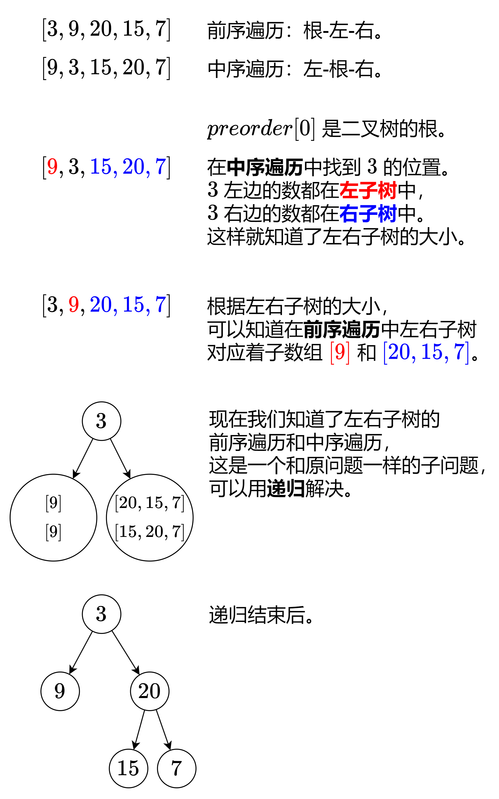

[105. Construct Binary Tree from Preorder and Inorder Traversal](https://leetcode.com/problems/construct-binary-tree-from-preorder-and-inorder-traversal/)（[从前序与中序遍历序列构造二叉树](https://leetcode.cn/problems/construct-binary-tree-from-preorder-and-inorder-traversal/)）

Given two integer arrays `preorder`​ and `inorder`​ where `preorder`​ is the preorder traversal of a binary tree and `inorder`​ is the inorder traversal of the same tree, construct and return *the binary tree*.

给定两个整数数组 `preorder`​ 和 `inorder`​ ，其中 `preorder`​ 是二叉树的**先序遍历**， `inorder`​ 是同一棵树的**中序遍历**，请构造二叉树并返回其根节点。

**Example 1:**

​​

```java
Input: preorder = [3,9,20,15,7], inorder = [9,3,15,20,7]
Output: [3,9,20,null,null,15,7]
```

**Example 2:**

```java
Input: preorder = [-1], inorder = [-1]
Output: [-1]
```

​​

# 方法一：数组

## Java

```java
/**
 * Definition for a binary tree node.
 * public class TreeNode {
 *     int val;
 *     TreeNode left;
 *     TreeNode right;
 *     TreeNode() {}
 *     TreeNode(int val) { this.val = val; }
 *     TreeNode(int val, TreeNode left, TreeNode right) {
 *         this.val = val;
 *         this.left = left;
 *         this.right = right;
 *     }
 * }
 */
class Solution {
    public TreeNode buildTree(int[] preorder, int[] inorder) {
        int n = preorder.length;
        if (n == 0) {
            return null;
        }
        int leftSize = indexOf(inorder, preorder[0]);
        int[] leftPre = Arrays.copyOfRange(preorder, 1, 1 + leftSize);
        int[] rightPre = Arrays.copyOfRange(preorder, 1 + leftSize, n);
        int[] leftIn = Arrays.copyOfRange(inorder, 0, leftSize);
        int[] rightIn = Arrays.copyOfRange(inorder, 1 + leftSize, n);
        TreeNode left = buildTree(leftPre, leftIn);
        TreeNode right = buildTree(rightPre, rightIn);
        return new TreeNode(preorder[0], left, right);
    }

    public int indexOf(int[] array, int value) {
        for (int i = 0; ; i++) {
            if (array[i] == value) {
                return i;
            }
        }
    }
}
```

## Python

```python
class Solution:
    def buildTree(self, preorder: List[int], inorder: List[int]) -> Optional[TreeNode]:
        if not preorder:  # 空节点
            return None
        left_size = inorder.index(preorder[0])  # 左子树的大小
        left = self.buildTree(preorder[1: 1 + left_size], inorder[:left_size])
        right = self.buildTree(preorder[1 + left_size:], inorder[1 + left_size:])
        return TreeNode(preorder[0], left, right)
```

## 复杂度分析

* 时间复杂度：O(n<sup>2</sup>)，其中 n 为 preorder 的长度。最坏情况下二叉树是一条链，我们需要递归 O(n) 次，每次都需要 O(n) 的时间查找 preorder[0] 和复制数组。
* 空间复杂度：O(n<sup>2</sup>)。

# 方法二：Hashmap

上面的写法有两个优化点：

1. 用一个哈希表（或者数组）预处理 inorder 每个元素的下标，这样就可以 O(1) 查到 preorder[0] 在 inorder 的位置，从而 O(1) 知道左子树的大小。
2. 把递归参数改成子数组下标区间（左闭右开区间）的左右端点，从而避免复制数组。

## Java

```java
class Solution {
    public TreeNode buildTree(int[] preorder, int[] inorder) {
        int n = preorder.length;
        Map<Integer, Integer> index = new HashMap<>(n); // 预分配空间
        for (int i = 0; i < n; i++) {
            index.put(inorder[i], i);
        }
        return dfs(preorder, 0, n, inorder, 0, n, index); // 左闭右开区间
    }

    private TreeNode dfs(int[] preorder, int preL, int preR, int[] inorder, int inL, int inR, Map<Integer, Integer> index) {
        if (preL == preR) { // 空节点
            return null;
        }
        int leftSize = index.get(preorder[preL]) - inL; // 左子树的大小
        TreeNode left = dfs(preorder, preL + 1, preL + 1 + leftSize, inorder, inL, inL + leftSize, index);
        TreeNode right = dfs(preorder, preL + 1 + leftSize, preR, inorder, inL + 1 + leftSize, inR, index);
        return new TreeNode(preorder[preL], left, right);
    }
}
```

## Python

```python
class Solution:
    def buildTree(self, preorder: List[int], inorder: List[int]) -> Optional[TreeNode]:
        index = {x: i for i, x in enumerate(inorder)}

        def dfs(pre_l: int, pre_r: int, in_l: int, in_r: int) -> Optional[TreeNode]:
            if pre_l == pre_r:  # 空节点
                return None
            left_size = index[preorder[pre_l]] - in_l  # 左子树的大小
            left = dfs(pre_l + 1, pre_l + 1 + left_size, in_l, in_l + left_size)
            right = dfs(pre_l + 1 + left_size, pre_r, in_l + 1 + left_size, in_r)
            return TreeNode(preorder[pre_l], left, right)

        return dfs(0, len(preorder), 0, len(inorder))  # 左闭右开区间
```

## 复杂度分析

* 时间复​杂度：O(n)，其中 n 为 preorder 的长度。递归 O(n) 次，每次只需要 O(1) 的时间。
* 空间复杂度：O(n)。

> 由于哈希表常数比数组大，实际运行效率可能不如写法一。

‍
