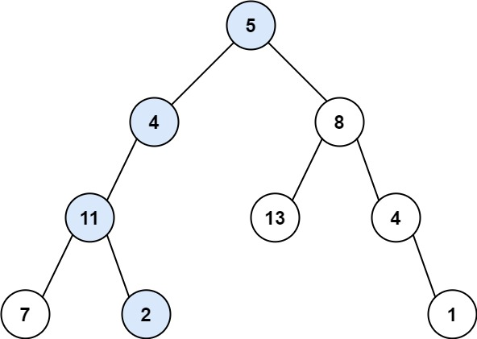
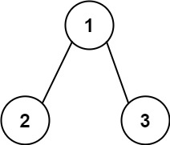

[112. Path Sum](https://leetcode.com/problems/path-sum/)（[路径总和](https://leetcode.cn/problems/path-sum/)）

Given the `root`​ of a binary tree and an integer `targetSum`​, return `true`​ if the tree has a **root-to-leaf** path such that adding up all the values along the path equals `targetSum`​.

A **leaf** is a node with no children.

给你二叉树的根节点 `root`​ 和一个表示目标和的整数 `targetSum`​ 。判断该树中是否存在 **根节点到叶子节点** 的路径，这条路径上所有节点值相加等于目标和 `targetSum`​ 。如果存在，返回 `true`​ ；否则，返回 `false`​ 。

**叶子节点** 是指没有子节点的节点。

**Example 1:**

​​

```java
Input: root = [5,4,8,11,null,13,4,7,2,null,null,null,1], targetSum = 22
Output: true
Explanation: The root-to-leaf path with the target sum is shown.
```

**Example 2:**

​​

```java
Input: root = [1,2,3], targetSum = 5
Output: false
Explanation: There two root-to-leaf paths in the tree:
(1 --> 2): The sum is 3.
(1 --> 3): The sum is 4.
There is no root-to-leaf path with sum = 5.
```

**Example 3:**

```java
Input: root = [], targetSum = 0
Output: false
Explanation: Since the tree is empty, there are no root-to-leaf paths.
```

# Java

```java
/**
 * Definition for a binary tree node.
 * public class TreeNode {
 *     int val;
 *     TreeNode left;
 *     TreeNode right;
 *     TreeNode() {}
 *     TreeNode(int val) { this.val = val; }
 *     TreeNode(int val, TreeNode left, TreeNode right) {
 *         this.val = val;
 *         this.left = left;
 *         this.right = right;
 *     }
 * }
 */
class Solution {
    public boolean hasPathSum(TreeNode root, int targetSum) {
        if (root == null) return false;
        targetSum -= root.val;
        if (root.left == null && root.right == null) {
            return targetSum == 0;
        }
        return hasPathSum(root.left, targetSum) || hasPathSum(root.right, targetSum);
    }
}
```

# 复杂度分析

* 时间复杂度：O(n)，其中 n 为二叉树的节点个数。
* 空间复杂度：O(n)。最坏情况下，二叉树退化成一条链，递归需要 O(n) 的栈空间。

‍
