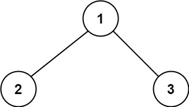

# 124. Binary Tree Maximum Path Sum（二叉树中的最大路径和）

[124. Binary Tree Maximum Path Sum](https://leetcode.com/problems/binary-tree-maximum-path-sum/)（[二叉树中的最大路径和](https://leetcode.cn/problems/binary-tree-maximum-path-sum/)）

A **path** in a binary tree is a sequence of nodes where each pair of adjacent nodes in the sequence has an edge connecting them. A node can only appear in the sequence **at most once**. Note that the path does not need to pass through the root.

The **path sum** of a path is the sum of the node's values in the path.

Given the `root`​ of a binary tree, return *the maximum* ***path sum*** *of any* ***non-empty*** *path*.

二叉树中的 **路径** 被定义为一条节点序列，序列中每对相邻节点之间都存在一条边。同一个节点在一条路径序列中 **至多出现一次** 。该路径 **至少包含一个** 节点，且不一定经过根节点。

**路径和** 是路径中各节点值的总和。

给你一个二叉树的根节点 `root`​ ，返回其 **最大路径和** 。

**Example 1:**

​​

```java
Input: root = [1,2,3]
Output: 6
Explanation: The optimal path is 2 -> 1 -> 3 with a path sum of 2 + 1 + 3 = 6.
```

**Example 2:**

​​

```java
Input: root = [-10,9,20,null,null,15,7]
Output: 42
Explanation: The optimal path is 15 -> 20 -> 7 with a path sum of 15 + 20 + 7 = 42.
```

# Java

```java
class Solution {
    private int ans = Integer.MIN_VALUE;

    public int maxPathSum(TreeNode root) {
        dfs(root);
        return ans;
    }

    private int dfs(TreeNode node) {
        if (node == null) {
            return 0; // 没有节点，和为 0
        }
        int lVal = dfs(node.left); // 左子树最大链和
        int rVal = dfs(node.right); // 右子树最大链和
        ans = Math.max(ans, lVal + rVal + node.val); // 两条链拼成路径
        return Math.max(Math.max(lVal, rVal) + node.val, 0); // 当前子树最大链和
    }
}
```

# 复杂度分析

* 时间复杂度：O(n)，其中 n 为二叉树的节点个数。
* 空间复杂度：O(n)。最坏情况下，二叉树退化成一条链，递归需要 O(n) 的栈空间。

‍
