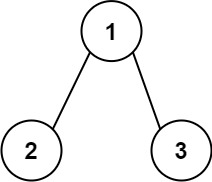
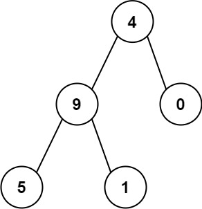

[129. Sum Root to Leaf Numbers](https://leetcode.com/problems/sum-root-to-leaf-numbers/)（[求根节点到叶节点数字之和](https://leetcode.cn/problems/sum-root-to-leaf-numbers/)）

You are given the `root`​ of a binary tree containing digits from `0`​ to `9`​ only.

Each root-to-leaf path in the tree represents a number.

* For example, the root-to-leaf path `1 -> 2 -> 3`​ represents the number `123`​.

Return *the total sum of all root-to-leaf numbers*. Test cases are generated so that the answer will fit in a **32-bit** integer.

A **leaf** node is a node with no children.

给你一个二叉树的根节点 `root`​ ，树中每个节点都存放有一个 `0`​ 到 `9`​ 之间的数字。每条从根节点到叶节点的路径都代表一个数字：

* 例如，从根节点到叶节点的路径 `1 -> 2 -> 3`​ 表示数字 `123`​ 。

计算从根节点到叶节点生成的 **所有数字之和** 。

**叶节点** 是指没有子节点的节点。

**Example 1:**

​​

```java
Input: root = [1,2,3]
Output: 25
Explanation:
The root-to-leaf path 1->2 represents the number 12.
The root-to-leaf path 1->3 represents the number 13.
Therefore, sum = 12 + 13 = 25.
```

**Example 2:**

​​

```java
Input: root = [4,9,0,5,1]
Output: 1026
Explanation:
The root-to-leaf path 4->9->5 represents the number 495.
The root-to-leaf path 4->9->1 represents the number 491.
The root-to-leaf path 4->0 represents the number 40.
Therefore, sum = 495 + 491 + 40 = 1026.
```

# Java

```java
/**
 * Definition for a binary tree node.
 * public class TreeNode {
 *     int val;
 *     TreeNode left;
 *     TreeNode right;
 *     TreeNode() {}
 *     TreeNode(int val) { this.val = val; }
 *     TreeNode(int val, TreeNode left, TreeNode right) {
 *         this.val = val;
 *         this.left = left;
 *         this.right = right;
 *     }
 * }
 */
class Solution {
    public int sumNumbers(TreeNode root) {
        return dfs(root, 0);
    }
    public int dfs(TreeNode node, int sum) {
        if (node == null) {
            return 0;
        }
        sum = sum * 10 + node.val;
        if (node.left == null && node.right == null) {
            return sum;
        }
        return dfs(node.left, sum) + dfs(node.right, sum);
    }
}
```

#### 复杂度分析

* 时间复杂度：O(n)，其中 n 为二叉树的节点个数。
* 空间复杂度：O(n)。最坏情况下，二叉树退化成一条链，递归需要 O(n) 的栈空间。

‍
