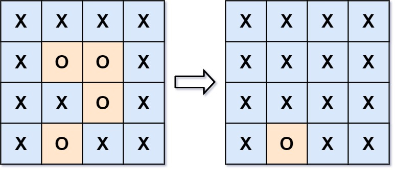

# 130. Surrounded Regions（被围绕的区域）

[130. Surrounded Regions](https://leetcode.com/problems/surrounded-regions/)（[被围绕的区域](https://leetcode.cn/problems/surrounded-regions/)）

You are given an `m x n`​ matrix `board`​ containing **letters** `'X'`​ and `'O'`​, **capture regions** that are **surrounded**:

* **Connect**: A cell is connected to adjacent cells horizontally or vertically.
* **Region**: To form a region **connect every** `'O'`​ cell.
* **Surround**: The region is surrounded with `'X'`​ cells if you can **connect the region** with `'X'`​ cells and none of the region cells are on the edge of the `board`​.

A **surrounded region is captured** by replacing all `'O'`​s with `'X'`​s in the input matrix `board`​.

给你一个 `m x n`​ 的矩阵 `board`​ ，由若干字符 `'X'`​ 和 `'O'`​ 组成，**捕获** 所有 **被围绕的区域**：

* **连接：** 一个单元格与水平或垂直方向上相邻的单元格连接。
* **区域：连接所有** `'O'`​ 的单元格来形成一个区域。
* **围绕：** 如果您可以用 `'X'`​ 单元格 **连接这个区域**，并且区域中没有任何单元格位于 `board`​ 边缘，则该区域被 `'X'`​ 单元格围绕。

通过将输入矩阵 `board`​ 中的所有 `'O'`​ 替换为 `'X'`​ 来 **捕获被围绕的区域**。

**Example 1:**

> **Input:**  **board =**   **[[&quot;X&quot;,&quot;X&quot;,&quot;X&quot;,&quot;X&quot;],[&quot;X&quot;,&quot;O&quot;,&quot;O&quot;,&quot;X&quot;],[&quot;X&quot;,&quot;X&quot;,&quot;O&quot;,&quot;X&quot;],[&quot;X&quot;,&quot;O&quot;,&quot;X&quot;,&quot;X&quot;]]**
>
> **Output:**   **[[&quot;X&quot;,&quot;X&quot;,&quot;X&quot;,&quot;X&quot;],[&quot;X&quot;,&quot;X&quot;,&quot;X&quot;,&quot;X&quot;],[&quot;X&quot;,&quot;X&quot;,&quot;X&quot;,&quot;X&quot;],[&quot;X&quot;,&quot;O&quot;,&quot;X&quot;,&quot;X&quot;]]**
>
> **Explanation:**
>
> ​​
>
> In the above diagram, the bottom region is not captured because it is on the edge of the board and cannot be surrounded.

**Example 2:**

> **Input:**  **board =**   **[[&quot;X&quot;]]**
>
> **Output:**   **[[&quot;X&quot;]]**

# DFS

## Python

```python
class Solution:
    def solve(self, board: List[List[str]]) -> None:
        """
        Do not return anything, modify board in-place instead.
        """
		if not board:
            return

        def dfs(i, j):
            if not 0 <= i < len(board) or not 0 <= j < len(board[0]) or board[i][j] != 'O':
                return
            board[i][j] = 'Y'
            dfs(i + 1, j)
            dfs(i - 1, j)
            dfs(i, j + 1)
            dfs(i, j - 1)

        for i in range(len(board)):
            dfs(i, 0)
            dfs(i, len(board[0]) - 1)
      
        for j in range(len(board[0])):
            dfs(0, j)
            dfs(len(board) - 1, j)

        for i in range(len(board)):
            for j in range(len(board[0])):
                if board[i][j] == 'O':
                    board[i][j] = 'X'
                if board[i][j] == 'Y':
                    board[i][j] = 'O'
```

## 复杂度分析

* 时间复杂度：O(n×m)，其中 n 和 m 分别为矩阵的行数和列数。深度优先搜索过程中，每一个点至多只会被标记一次。
* 空间复杂度：O(n×m)，其中 n 和 m 分别为矩阵的行数和列数。主要为深度优先搜索的栈的开销。

# BFS

## Python

```python
class Solution:
    def solve(self, board: List[List[str]]) -> None:
        if not board:
            return
      
        n, m = len(board), len(board[0])
        que = collections.deque()
        for i in range(n):
            if board[i][0] == "O":
                que.append((i, 0))
                board[i][0] = "A"
            if board[i][m - 1] == "O":
                que.append((i, m - 1))
                board[i][m - 1] = "A"
        for i in range(m - 1):
            if board[0][i] == "O":
                que.append((0, i))
                board[0][i] = "A"
            if board[n - 1][i] == "O":
                que.append((n - 1, i))
                board[n - 1][i] = "A"
      
        while que:
            x, y = que.popleft()
            for mx, my in [(x - 1, y), (x + 1, y), (x, y - 1), (x, y + 1)]:
                if 0 <= mx < n and 0 <= my < m and board[mx][my] == "O":
                    que.append((mx, my))
                    board[mx][my] = "A"
      
        for i in range(n):
            for j in range(m):
                if board[i][j] == "A":
                    board[i][j] = "O"
                elif board[i][j] == "O":
                    board[i][j] = "X"
```

## 复杂度分析

* 时间复杂度：O(n×m)，其中 n 和 m 分别为矩阵的行数和列数。广度优先搜索过程中，每一个点至多只会被标记一次。
* 空间复杂度：O(n×m)，其中 n 和 m 分别为矩阵的行数和列数。主要为广度优先搜索的队列的开销。

‍
