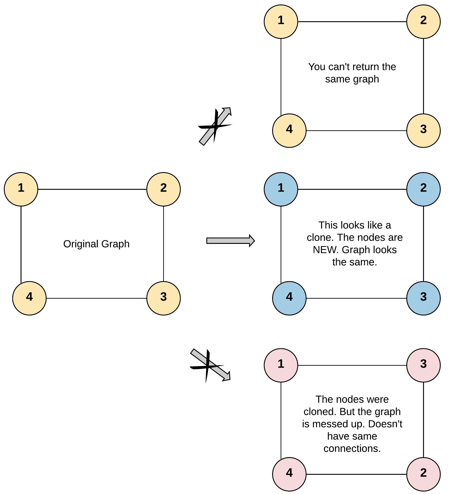

[133. Clone Graph](https://leetcode.com/problems/clone-graph/)（[克隆图](https://leetcode.cn/problems/clone-graph/)）

Given a reference of a node in a **[connected](https://en.wikipedia.org/wiki/Connectivity_(graph_theory)#Connected_graph)** undirected graph.

Return a **[deep copy](https://en.wikipedia.org/wiki/Object_copying#Deep_copy)** (clone) of the graph.

Each node in the graph contains a value (`int`​) and a list (`List[Node]`​) of its neighbors.

给你无向 **[连通](https://baike.baidu.com/item/%E8%BF%9E%E9%80%9A%E5%9B%BE/6460995?fr=aladdin)** 图中一个节点的引用，请你返回该图的 **[深拷贝](https://baike.baidu.com/item/%E6%B7%B1%E6%8B%B7%E8%B4%9D/22785317?fr=aladdin)**（克隆）。

图中的每个节点都包含它的值 `val`​（`int`​） 和其邻居的列表（`list[Node]`​）。

```
class Node {
    public int val;
    public List<Node> neighbors;
}
```

**Test case format:**

For simplicity, each node's value is the same as the node's index (1-indexed). For example, the first node with `val == 1`​, the second node with `val == 2`​, and so on. The graph is represented in the test case using an adjacency list.

**An adjacency list** is a collection of unordered **lists** used to represent a finite graph. Each list describes the set of neighbors of a node in the graph.

The given node will always be the first node with `val = 1`​. You must return the **copy of the given node** as a reference to the cloned graph.

**测试用例格式：**

简单起见，每个节点的值都和它的索引相同。例如，第一个节点值为 1（`val = 1`​），第二个节点值为 2（`val = 2`​），以此类推。该图在测试用例中使用邻接列表表示。

**邻接列表** 是用于表示有限图的无序列表的集合。每个列表都描述了图中节点的邻居集。

给定节点将始终是图中的第一个节点（值为 1）。你必须将 **给定节点的拷贝** 作为对克隆图的引用返回。

**Example 1:**

​​

```python
Input: adjList = [[2,4],[1,3],[2,4],[1,3]]
Output: [[2,4],[1,3],[2,4],[1,3]]
Explanation: There are 4 nodes in the graph.
1st node (val = 1)'s neighbors are 2nd node (val = 2) and 4th node (val = 4).
2nd node (val = 2)'s neighbors are 1st node (val = 1) and 3rd node (val = 3).
3rd node (val = 3)'s neighbors are 2nd node (val = 2) and 4th node (val = 4).
4th node (val = 4)'s neighbors are 1st node (val = 1) and 3rd node (val = 3).
```

**Example 2:**

​​

```python
Input: adjList = [[]]
Output: [[]]
Explanation: Note that the input contains one empty list. The graph consists of only one node with val = 1 and it does not have any neighbors.
```

**Example 3:**

```python
Input: adjList = []
Output: []
Explanation: This an empty graph, it does not have any nodes.
```

# DFS

## Python

```python
"""
# Definition for a Node.
class Node:
    def __init__(self, val = 0, neighbors = None):
        self.val = val
        self.neighbors = neighbors if neighbors is not None else []
"""

from typing import Optional
class Solution:
    def cloneGraph(self, node: Optional['Node']) -> Optional['Node']:
        visited = {}
        def dfs(node):
            if not node:
                return
            if node in visited:
                return visited[node]
            clone = Node(node.val, [])
            visited[node] = clone
            for n in node.neighbors:
                clone.neighbors.append(dfs(n))
            return clone
        return dfs(node)
```

## 复杂度分析

* 时间复杂度：O(N)，其中 N 表示节点数量。深度优先搜索遍历图的过程中每个节点只会被访问一次。
* 空间复杂度：O(N)。存储克隆节点和原节点的哈希表需要 O(N) 的空间，递归调用栈需要 O(H) 的空间，其中 H 是图的深度，经过放缩可以得到 O(H)=O(N)，因此总体空间复杂度为 O(N)。

# BFS

## Python

```python
from collections import deque
class Solution(object):
    def cloneGraph(self, node: 'Node') -> 'Node':
        if not node:
            return node
        visited = {}
        # 将题目给定的节点添加到队列
        queue = deque([node])
        # 克隆第一个节点并存储到哈希表中
        visited[node] = Node(node.val, [])
        # 广度优先搜索
        while queue:
            # 取出队列的头节点
            n = queue.popleft()
            # 遍历该节点的邻居
            for neighbor in n.neighbors:
                if neighbor not in visited:
                    # 如果没有被访问过，就克隆并存储在哈希表中
                    visited[neighbor] = Node(neighbor.val, [])
                    # 将邻居节点加入队列中
                    queue.append(neighbor)
                # 更新当前节点的邻居列表
                visited[n].neighbors.append(visited[neighbor])
        return visited[node]
```

## 复杂度分析

* 时间复杂度：O(N)，其中 N 表示节点数量。广度优先搜索遍历图的过程中每个节点只会被访问一次。
* 空间复杂度：O(N)。哈希表使用 O(N) 的空间。广度优先搜索中的队列在最坏情况下会达到 O(N) 的空间复杂度，因此总体空间复杂度为 O(N)。

‍
