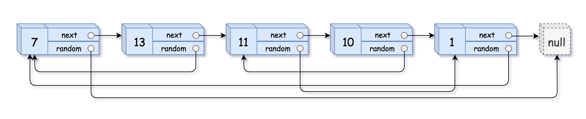
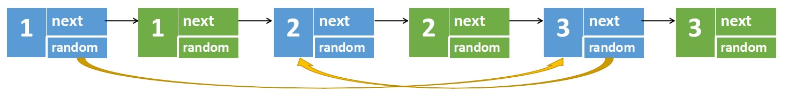
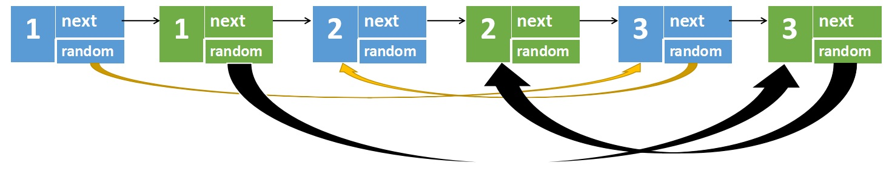
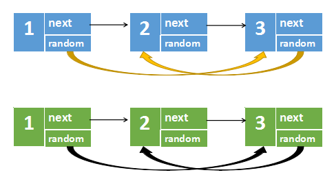
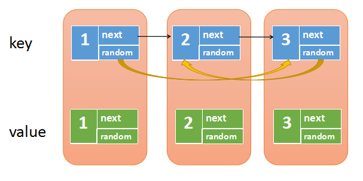
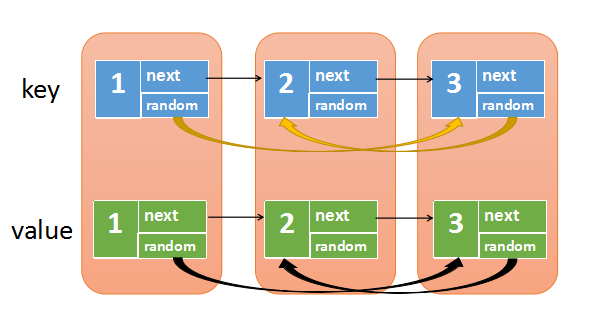

# 138. Copy List with Random Pointer（随机链表的复制）

[138. Copy List with Random Pointer](https://leetcode.com/problems/copy-list-with-random-pointer/)（[随机链表的复制](https://leetcode.cn/problems/copy-list-with-random-pointer/)）

A linked list of length `n`​ is given such that each node contains an additional random pointer, which could point to any node in the list, or `null`​.

Construct a **[deep copy](https://en.wikipedia.org/wiki/Object_copying#Deep_copy)** of the list. The deep copy should consist of exactly `n`​ **brand new** nodes, where each new node has its value set to the value of its corresponding original node. Both the `next`​ and `random`​ pointer of the new nodes should point to new nodes in the copied list such that the pointers in the original list and copied list represent the same list state. **None of the pointers in the new list should point to nodes in the original list**.

For example, if there are two nodes `X`​ and `Y`​ in the original list, where `X.random --> Y`​, then for the corresponding two nodes `x`​ and `y`​ in the copied list, `x.random --> y`​.

Return *the head of the copied linked list*.

The linked list is represented in the input/output as a list of `n`​ nodes. Each node is represented as a pair of `[val, random_index]`​ where:

* ​`val`​: an integer representing `Node.val`​
* ​`random_index`​: the index of the node (range from `0`​ to `n-1`​) that the `random`​ pointer points to, or `null`​ if it does not point to any node.

Your code will **only** be given the `head`​ of the original linked list.

给你一个长度为 `n`​ 的链表，每个节点包含一个额外增加的随机指针 `random`​ ，该指针可以指向链表中的任何节点或空节点。

构造这个链表的 **[深拷贝](https://baike.baidu.com/item/%E6%B7%B1%E6%8B%B7%E8%B4%9D/22785317?fr=aladdin)**。 深拷贝应该正好由 `n`​ 个 **全新** 节点组成，其中每个新节点的值都设为其对应的原节点的值。新节点的 `next`​ 指针和 `random`​ 指针也都应指向复制链表中的新节点，并使原链表和复制链表中的这些指针能够表示相同的链表状态。**复制链表中的指针都不应指向原链表中的节点 **。

例如，如果原链表中有 `X`​ 和 `Y`​ 两个节点，其中 `X.random --> Y`​ 。那么在复制链表中对应的两个节点 `x`​ 和 `y`​ ，同样有 `x.random --> y`​ 。

返回复制链表的头节点。

用一个由 `n`​ 个节点组成的链表来表示输入/输出中的链表。每个节点用一个 `[val, random_index]`​ 表示：

* ​`val`​：一个表示 `Node.val`​ 的整数。
* ​`random_index`​：随机指针指向的节点索引（范围从 `0`​ 到 `n-1`​）；如果不指向任何节点，则为  `null`​ 。

你的代码 **只** 接受原链表的头节点 `head`​ 作为传入参数。

**Example 1:**

​​

```java
Input: head = [[7,null],[13,0],[11,4],[10,2],[1,0]]
Output: [[7,null],[13,0],[11,4],[10,2],[1,0]]
```

**Example 2:**

​​

```java
Input: head = [[1,1],[2,1]]
Output: [[1,1],[2,1]]
```

**Example 3:**

​​

```java
Input: head = [[3,null],[3,0],[3,null]]
Output: [[3,null],[3,0],[3,null]]
```

# 方法一：迭代 + 节点拆分

## JavaScript

```javascript
/**
 * // Definition for a _Node.
 * function _Node(val, next, random) {
 *    this.val = val;
 *    this.next = next;
 *    this.random = random;
 * };
 */

/**
 * @param {_Node} head
 * @return {_Node}
 */
var copyRandomList = function(head) {
    if(head === null){
        return null;
    }
    // Step 1: Create a new node for each original node and insert it next to the original node
    let cur = head;
    while(cur){
        let newNode = new _Node(cur.val, cur.next, null);
        cur.next = newNode;
        cur = cur.next.next;
    }
    // Step 2: Assign the random pointers for the new nodes
    cur = head;
    while(cur){
        let newNode = cur.next;
        newNode.random = cur.random ? cur.random.next : null;
        cur = cur.next.next; 
    }
    // Step 3: Separate the original list and the copied list
    cur = head;
    let newHead = head.next;
    while(cur){
        let newNode = cur.next;
        cur.next = newNode.next;
        newNode.next = newNode.next ? newNode.next.next : null;
        cur = cur.next;
    }
    return newHead;
};

```

## Java

```java
class Solution {
    public Node copyRandomList(Node head) {
        if (head == null) {
            return null;
        }
        for (Node node = head; node != null; node = node.next.next) {
            Node nodeNew = new Node(node.val);
            nodeNew.next = node.next;
            node.next = nodeNew;
        }
        for (Node node = head; node != null; node = node.next.next) {
            Node nodeNew = node.next;
            nodeNew.random = (node.random != null) ? node.random.next : null;
        }
        Node headNew = head.next;
        for (Node node = head; node != null; node = node.next) {
            Node nodeNew = node.next;
            node.next = node.next.next;
            nodeNew.next = (nodeNew.next != null) ? nodeNew.next.next : null;
        }
        return headNew;
    }
}
```

## 复杂度分析

* 时间复杂度：O(n)，其中 n 是链表的长度。我们只需要遍历该链表三次。
* 空间复杂度：O(1)。注意返回值不计入空间复杂度。

**第一步**，根据遍历到的原节点创建对应的新节点，每个新创建的节点是在原节点后面，比如下图中原节点**1**不再指向原原节点**2**，而是指向新节点**1**

​​

**第二步**是最关键的一步，用来设置新链表的随机指针

​​

上图中，我们可以观察到这么一个规律

* 原节点1的随机指针指向原节点`3`​，新节点`1`​的随机指针指向的是原节点`3`​的`next`​
* 原节点3的随机指针指向原节点`2`​，新节点`3`​的随机指针指向的是原节点`2`​的`next`​
* 也就是，原节点`i`​的随机指针(如果有的话)，指向的是原节点`j`​，那么新节点`i`​的随机指针，指向的是原节点`j`​的next

**第三步**就简单了，只要将两个链表分离开，再返回新链表就可以了

​​

# 方法二：回溯 + 哈希表

## JavaScript

```javascript
var copyRandomList = function(head, cachedNode = new Map()) {
    if (head === null) {
        return null;
    }
    if (!cachedNode.has(head)) {
        cachedNode.set(head, {val: head.val}), Object.assign(cachedNode.get(head), {next: copyRandomList(head.next, cachedNode), random: copyRandomList(head.random, cachedNode)})
    }
    return cachedNode.get(head);
}

```

## Java

```java
class Solution {
    Map<Node, Node> cachedNode = new HashMap<Node, Node>();

    public Node copyRandomList(Node head) {
        if (head == null) {
            return null;
        }
        if (!cachedNode.containsKey(head)) {
            Node headNew = new Node(head.val);
            cachedNode.put(head, headNew);
            headNew.next = copyRandomList(head.next);
            headNew.random = copyRandomList(head.random);
        }
        return cachedNode.get(head);
    }
}
```

**不使用recursion的方法**

首先创建一个哈希表，再遍历原链表，遍历的同时再不断创建新节点，我们将原节点作为**key**，新节点作为**value**放入哈希表中

​​

第二步我们再遍历原链表，这次我们要将新链表的next和random指针给设置上

​​

从上图中我们可以发现，原节点和新节点是一一对应的关系，所以

* map.get(原节点)，得到的就是对应的新节点
* map.get(原节点.next)，得到的就是对应的新节点.next
* map.get(原节点.random)，得到的就是对应的新节点.random

所以，我们只需要再次遍历原链表，然后设置：

* 新节点.next -> map.get(原节点.next)
* 新节点.random -> map.get(原节点.random)

最后，我们然后map.get(head)，也就是对应的新链表的头节点，就可以解决此问题了。

```java
class Solution {
    public Node copyRandomList(Node head) {
        if(head==null) {
            return null;
        }
        //创建一个哈希表，key是原节点，value是新节点
        Map<Node,Node> map = new HashMap<Node,Node>();
        Node p = head;
        //将原节点和新节点放入哈希表中
        while(p!=null) {
            Node newNode = new Node(p.val);
            map.put(p,newNode);
            p = p.next;
        }
        p = head;
        //遍历原链表，设置新节点的next和random
        while(p!=null) {
            Node newNode = map.get(p);
            //p是原节点，map.get(p)是对应的新节点，p.next是原节点的下一个
            //map.get(p.next)是原节点下一个对应的新节点
            if(p.next!=null) {
                newNode.next = map.get(p.next);
            }
            //p.random是原节点随机指向
            //map.get(p.random)是原节点随机指向  对应的新节点 
            if(p.random!=null) {
                newNode.random = map.get(p.random);
            }
            p = p.next;
        }
        //返回头结点，即原节点对应的value(新节点)
        return map.get(head);
    }
}
```

## 复杂度分析

* 时间复杂度：O(n)，其中 n 是链表的长度。对于每个节点，我们至多访问其「后继节点」和「随机指针指向的节点」各一次，均摊每个点至多被访问两次。
* 空间复杂度：O(n)，其中 n 是链表的长度。为哈希表的空间开销。

‍
