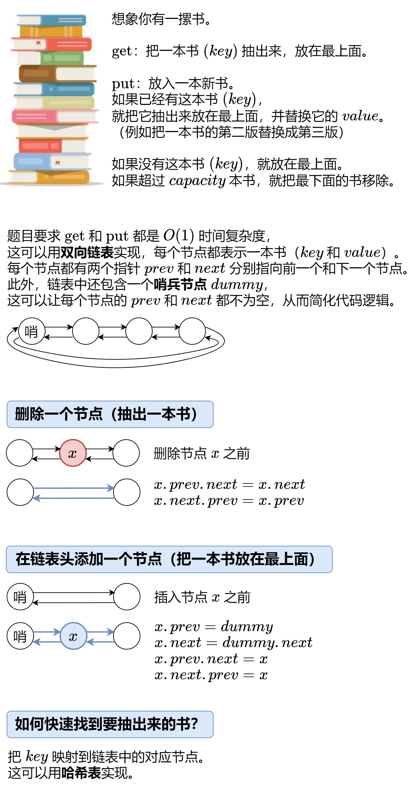

[146. LRU Cache](https://leetcode.com/problems/lru-cache/)（[LRU 缓存](https://leetcode.cn/problems/lru-cache/)）

Design a data structure that follows the constraints of a **[Least Recently Used (LRU) cache](https://en.wikipedia.org/wiki/Cache_replacement_policies#LRU)**.

Implement the `LRUCache`​ class:

* ​`LRUCache(int capacity)`​ Initialize the LRU cache with **positive** size `capacity`​.
* ​`int get(int key)`​ Return the value of the `key`​ if the key exists, otherwise return `-1`​.
* ​`void put(int key, int value)`​ Update the value of the `key`​ if the `key`​ exists. Otherwise, add the `key-value`​ pair to the cache. If the number of keys exceeds the `capacity`​ from this operation, **evict** the least recently used key.

The functions `get`​ and `put`​ must each run in `O(1)`​ average time complexity.

请你设计并实现一个满足  [LRU (最近最少使用) 缓存](https://baike.baidu.com/item/LRU) 约束的数据结构。

实现 `LRUCache`​ 类：

* ​`LRUCache(int capacity)`​ 以 **正整数** 作为容量 `capacity`​ 初始化 LRU 缓存
* ​`int get(int key)`​ 如果关键字 `key`​ 存在于缓存中，则返回关键字的值，否则返回 `-1`​ 。
* ​`void put(int key, int value)`​ 如果关键字 `key`​ 已经存在，则变更其数据值 `value`​ ；如果不存在，则向缓存中插入该组 `key-value`​ 。如果插入操作导致关键字数量超过 `capacity`​ ，则应该 **逐出** 最久未使用的关键字。

函数 `get`​ 和 `put`​ 必须以 `O(1)`​ 的平均时间复杂度运行。

**Example 1:**

```javascript
Input
["LRUCache", "put", "put", "get", "put", "get", "put", "get", "get", "get"]
[[2], [1, 1], [2, 2], [1], [3, 3], [2], [4, 4], [1], [3], [4]]
Output
[null, null, null, 1, null, -1, null, -1, 3, 4]

Explanation
LRUCache lRUCache = new LRUCache(2);
lRUCache.put(1, 1); // cache is {1=1}
lRUCache.put(2, 2); // cache is {1=1, 2=2}
lRUCache.get(1);    // return 1
lRUCache.put(3, 3); // LRU key was 2, evicts key 2, cache is {1=1, 3=3}
lRUCache.get(2);    // returns -1 (not found)
lRUCache.put(4, 4); // LRU key was 1, evicts key 1, cache is {4=4, 3=3}
lRUCache.get(1);    // return -1 (not found)
lRUCache.get(3);    // return 3
lRUCache.get(4);    // return 4
```

​​

# JavaScript

```javascript
var Node = function(key = 0, value = 0) {
    this.key = key;
    this.value = value;
    this.prev = null;
    this.next = null;
}

var LRUCache = function(capacity) {
    this.capacity = capacity;
    this.dummy = new Node();
    this.dummy.prev = this.dummy;
    this.dummy.next = this.dummy;
    this.map = new Map();
};

// 删除一个节点（抽出一本书）
LRUCache.prototype.remove = function(x) {
        x.prev.next = x.next;
        x.next.prev = x.prev;
    }

// 在链表头添加一个节点（把一本书放在最上面）
LRUCache.prototype.pushFront = function(x) {
        x.prev = this.dummy;
        x.next = this.dummy.next;
        x.prev.next = x;
        x.next.prev = x;
    }

LRUCache.prototype.get = function(key) {
    if (!this.map.has(key)) { // 没有这本书
        return -1;
    }
    const node = this.map.get(key); // 有这本书
    this.remove(node); // 把这本书抽出来
    this.pushFront(node); // 放在最上面
    return node.value;
};

LRUCache.prototype.put = function(key, value) {
    if (this.map.has(key)) { // 有这本书
        const node = this.map.get(key);
        node.value = value; // 更新 value
        this.remove(node); // 把这本书抽出来
        this.pushFront(node); // 放在最上面
    } else {
        const node = new Node(key, value); // 新书
        this.map.set(key, node);
        this.pushFront(node); // 放在最上面
        if (this.map.size > this.capacity) { // 书太多了
            const backNode = this.dummy.prev;
            this.map.delete(backNode.key);
            this.remove(backNode); // 去掉最后一本书
        }
    }
};

```

# Java

```java
class Node {
    int key;
    int value;
    Node prev;
    Node next;

    Node(int key, int value) {
        this.key = key;
        this.value = value;
        this.prev = null;
        this.next = null;
    }
}

class LRUCache {
    private final int capacity;
    private final Node dummy = new Node(0, 0);
  	private final Map<Integer, Node> map= new HashMap<>();

    public LRUCache(int capacity) {
        this.capacity = capacity;
        this.dummy.prev = dummy;
        this.dummy.next = dummy;
    }

    private void remove(Node x) {
        x.prev.next = x.next;
        x.next.prev = x.prev;
    }

    private void pushFront(Node x) {
        x.prev = dummy;
        x.next = dummy.next;
        dummy.next.prev = x;
        dummy.next = x;
    }

    public int get(int key) {
        if (!map.containsKey(key)) {
            return -1;
        }
        Node node = map.get(key);
        remove(node);
        pushFront(node);
        return node.value;
    }

    public void put(int key, int value) {
        if (map.containsKey(key)) {
            Node node = map.get(key);
            node.value = value;
            remove(node);
            pushFront(node);
        } else {
            Node node = new Node(key, value);
            map.put(key, node);
            pushFront(node);
            if (map.size() > capacity) {
                Node backNode = dummy.prev;
                map.remove(backNode.key);
                remove(backNode);
            }
        }
    }
}
```

本题Java还可以使用LinkedHashMap

```java
public class LRUCache {
    private final int capacity;
    private final Map<Integer, Integer> cache = new LinkedHashMap<>(); // 自带双向链表

    public LRUCache(int capacity) {
        this.capacity = capacity;
    }

    public int get(int key) {
        // 删除 key，并利用返回值判断 key 是否在 cache 中
        Integer value = cache.remove(key);
        if (value != null) { // key 在 cache 中
            cache.put(key, value); // 把 key 移到链表末尾
            return value;
        }
        // key 不在 cache 中
        return -1;
    }

    public void put(int key, int value) {
        // 删除 key，并利用返回值判断 key 是否在 cache 中
        if (cache.remove(key) != null) { // key 在 cache 中
            cache.put(key, value); // 把 key 移到链表末尾
            return;
        }
        // key 不在 cache 中，那么就把 key 插入 cache，插入前判断 cache 是否满了
        if (cache.size() == capacity) { // cache 满了
            Integer oldestKey = cache.keySet().iterator().next();
            cache.remove(oldestKey); // 移除最久未使用 key
        }
        cache.put(key, value);
    }
}
```

# 复杂度分析

* 时间复杂度：对于 `put`​ 和 `get`​ 都是 O(1)。
* 空间复杂度：O(capacity)，因为哈希表和双向链表最多存储 capacity+1 个元素。

‍
