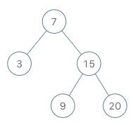
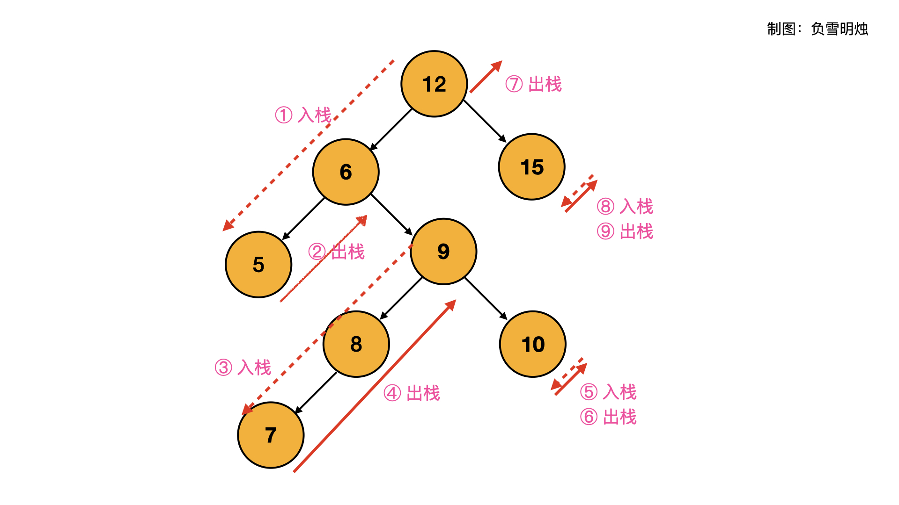

[173. Binary Search Tree Iterator](https://leetcode.com/problems/binary-search-tree-iterator/)（[二叉搜索树迭代器](https://leetcode.cn/problems/binary-search-tree-iterator/)）

Implement the `BSTIterator`​ class that represents an iterator over the **[in-order traversal](https://en.wikipedia.org/wiki/Tree_traversal#In-order_(LNR))** of a binary search tree (BST):

* ​`BSTIterator(TreeNode root)`​ Initializes an object of the `BSTIterator`​ class. The `root`​ of the BST is given as part of the constructor. The pointer should be initialized to a non-existent number smaller than any element in the BST.
* ​`boolean hasNext()`​ Returns `true`​ if there exists a number in the traversal to the right of the pointer, otherwise returns `false`​.
* ​`int next()`​ Moves the pointer to the right, then returns the number at the pointer.

Notice that by initializing the pointer to a non-existent smallest number, the first call to `next()`​ will return the smallest element in the BST.

You may assume that `next()`​ calls will always be valid. That is, there will be at least a next number in the in-order traversal when `next()`​ is called.

实现一个二叉搜索树迭代器类`BSTIterator`​ ，表示一个按中序遍历二叉搜索树（BST）的迭代器：

* `BSTIterator(TreeNode root)`​ 初始化 `BSTIterator`​ 类的一个对象。BST 的根节点 `root`​ 会作为构造函数的一部分给出。指针应初始化为一个不存在于 BST 中的数字，且该数字小于 BST 中的任何元素。

* ​`boolean hasNext()`​ 如果向指针右侧遍历存在数字，则返回 `true`​ ；否则返回 `false`​ 。
* ​`int next()`​将指针向右移动，然后返回指针处的数字。

注意，指针初始化为一个不存在于 BST 中的数字，所以对 `next()`​ 的首次调用将返回 BST 中的最小元素。

你可以假设 `next()`​ 调用总是有效的，也就是说，当调用 `next()`​ 时，BST 的中序遍历中至少存在一个下一个数字。

**Example 1:**

​​

```java
Input
["BSTIterator", "next", "next", "hasNext", "next", "hasNext", "next", "hasNext", "next", "hasNext"]
[[[7, 3, 15, null, null, 9, 20]], [], [], [], [], [], [], [], [], []]
Output
[null, 3, 7, true, 9, true, 15, true, 20, false]

Explanation
BSTIterator bSTIterator = new BSTIterator([7, 3, 15, null, null, 9, 20]);
bSTIterator.next();    // return 3
bSTIterator.next();    // return 7
bSTIterator.hasNext(); // return True
bSTIterator.next();    // return 9
bSTIterator.hasNext(); // return True
bSTIterator.next();    // return 15
bSTIterator.hasNext(); // return True
bSTIterator.next();    // return 20
bSTIterator.hasNext(); // return False
```

**Follow up:**

* Could you implement `next()`​ and `hasNext()`​ to run in average `O(1)`​ time and use `O(h)`​ memory, where `h`​ is the height of the tree?

# 方法一：扁平化

我们可以直接对二叉搜索树做一次完全的递归遍历，获取中序遍历的全部结果并保存在数组中。随后，我们利用得到的数组本身来实现迭代器。

## Java

```java
/**
 * Definition for a binary tree node.
 * public class TreeNode {
 *     int val;
 *     TreeNode left;
 *     TreeNode right;
 *     TreeNode() {}
 *     TreeNode(int val) { this.val = val; }
 *     TreeNode(int val, TreeNode left, TreeNode right) {
 *         this.val = val;
 *         this.left = left;
 *         this.right = right;
 *     }
 * }
 */
class BSTIterator {
    private int idx;
    private List<Integer> arr;

    public BSTIterator(TreeNode root) {
        idx = 0;
        arr = new ArrayList<>();
        inorderTraversal(root, arr);
    }
  
    public int next() {
        return arr.get(idx++);
    }
  
    public boolean hasNext() {
        return idx < arr.size();
    }

    public void inorderTraversal(TreeNode root, List<Integer> arr) {
        if (root == null) {
            return;
        }
        inorderTraversal(root.left, arr);
        arr.add(root.val);
        inorderTraversal(root.right, arr);

    }
}

/**
 * Your BSTIterator object will be instantiated and called as such:
 * BSTIterator obj = new BSTIterator(root);
 * int param_1 = obj.next();
 * boolean param_2 = obj.hasNext();
 */
```

## 复杂度分析

* 时间复杂度：初始化需要 O(n) 的时间，其中 n 为树中节点的数量。随后每次调用只需要 O(1) 的时间。
* 空间复杂度：O(n)，因为需要保存中序遍历的全部结果。

# 方法二：迭代

除了递归的方法外，我们还可以利用栈这一数据结构，通过迭代的方式对二叉树做中序遍历。此时，我们无需预先计算出中序遍历的全部结果，只需要实时维护当前栈的情况即可。

​​

## Java

```java
class BSTIterator {
    private TreeNode cur;
    private Deque<TreeNode> stack;

    public BSTIterator(TreeNode root) {
        cur = root;
        stack = new LinkedList<TreeNode>();
    }
  
    public int next() {
        while (cur != null) {
            stack.push(cur);
            cur = cur.left;
        }
        cur = stack.pop();
        int ret = cur.val;
        cur = cur.right;
        return ret;
    }
  
    public boolean hasNext() {
        return cur != null || !stack.isEmpty();
    }
}
```

## 复杂度分析

* 时间复杂度：显然，初始化和调用 hasNext() 都只需要 O(1) 的时间。每次调用 next() 函数最坏情况下需要 O(n) 的时间；但考虑到 n 次调用 next() 函数总共会遍历全部的 n 个节点，因此总的时间复杂度为 O(n)，因此单次调用平均下来的均摊复杂度为 O(1)。
* 空间复杂度：O(n)，其中 n 是二叉树的节点数量。空间复杂度取决于栈深度，而栈深度在二叉树为一条链的情况下会达到 O(n) 的级别。

‍
