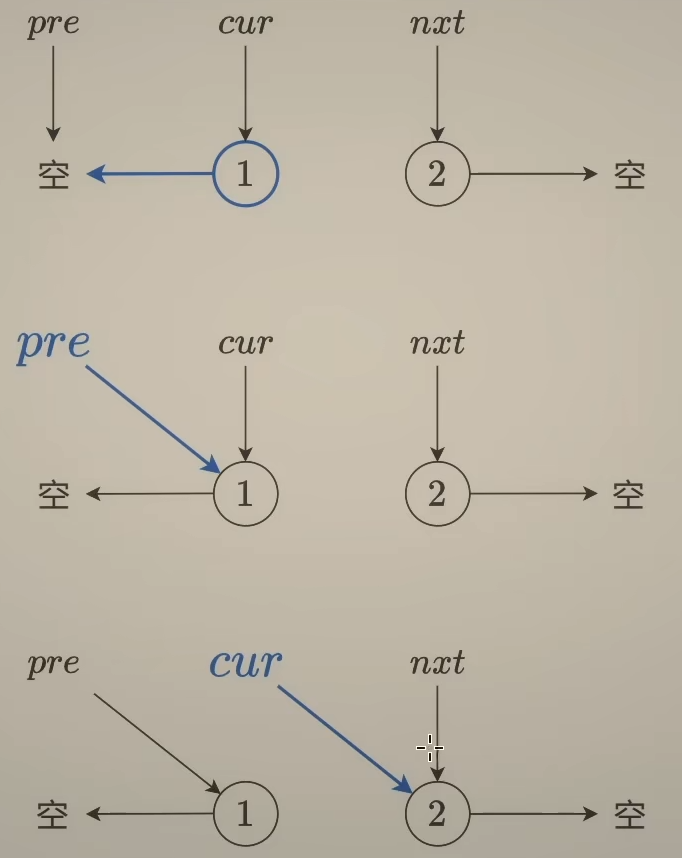

[206. Reverse Linked List](https://leetcode.com/problems/reverse-linked-list/)（[反转链表](https://leetcode.cn/problems/reverse-linked-list/)）

Given the `head`​ of a singly linked list, reverse the list, and return *the reversed list*.

给你单链表的头节点 `head`​ ，请你反转链表，并返回反转后的链表。

**Example 1:**

​​

```java
Input: head = [1,2,3,4,5]
Output: [5,4,3,2,1]
```

**Example 2:**

​​

```java
Input: head = [1,2]
Output: [2,1]
```

**Example 3:**

```java
Input: head = []
Output: []
```

# 方法一：迭代

​​

## JavaScript

```javascript
var reverseList = function(head) {
    let prev = null;
    let curr = head;
    while (curr) {
        const next = curr.next;
        curr.next = prev;
        prev = curr;
        curr = next;
    }
    return prev;
};
```

## Java

```java
class Solution {
    public ListNode reverseList(ListNode head) {
        ListNode prev = null;
        ListNode curr = head;
        while (curr != null) {
            ListNode next = curr.next;
            curr.next = prev;
            prev = curr;
            curr = next;
        }
        return prev;
    }
}
```

## 复杂度分析

* 时间复杂度：O(n)，其中 n 是链表的长度。需要遍历链表一次。
* 空间复杂度：O(1)。

# 方法二：递归

## JavaScript

```javascript
var reverseList = function(head) {
    if (head == null || head.next == null) {
        return head;
    }
    const newHead = reverseList(head.next);
    head.next.next = head;
    head.next = null;
    return newHead;
};
```

## Java

```java
class Solution {
    public ListNode reverseList(ListNode head) {
        if (head == null || head.next == null) {
            return head;
        }
        ListNode newHead = reverseList(head.next);
        head.next.next = head;
        head.next = null;
        return newHead;
    }
}
```

## 复杂度分析

* 时间复杂度：O(n)，其中 n 是链表的长度。需要对链表的每个节点进行反转操作。
* 空间复杂度：O(n)，其中 n 是链表的长度。空间复杂度主要取决于递归调用的栈空间，最多为 n 层。

‍
