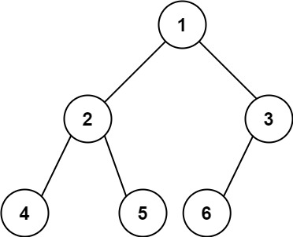

# 222. Count Complete Tree Nodes（完全二叉树的节点个数）

[222. Count Complete Tree Nodes](https://leetcode.com/problems/count-complete-tree-nodes/)（[完全二叉树的节点个数](https://leetcode.cn/problems/count-complete-tree-nodes/)）

Given the `root`​ of a **complete** binary tree, return the number of the nodes in the tree.

According to **[Wikipedia](http://en.wikipedia.org/wiki/Binary_tree#Types_of_binary_trees)**, every level, except possibly the last, is completely filled in a complete binary tree, and all nodes in the last level are as far left as possible. It can have between `1`​ and `2`​<sup>​`h`​</sup>​nodes inclusive at the last level `h`​.

Design an algorithm that runs in less than `O(n)`​ time complexity.

给你一棵** 完全二叉树** 的根节点 `root`​ ，求出该树的节点个数。

[完全二叉树](https://baike.baidu.com/item/%E5%AE%8C%E5%85%A8%E4%BA%8C%E5%8F%89%E6%A0%91/7773232?fr=aladdin) 的定义如下：在完全二叉树中，除了最底层节点可能没填满外，其余每层节点数都达到最大值，并且最下面一层的节点都集中在该层最左边的若干位置。若最底层为第 `h`​ 层，则该层包含 `1~ 2`​<sup>​`h`​</sup>​ 个节点。

**Example 1:**

​​

```java
Input: root = [1,2,3,4,5,6]
Output: 6
```

**Example 2:**

```java
Input: root = []
Output: 0
```

**Example 3:**

```java
Input: root = [1]
Output: 1
```

# 方法一：直接递归

## Java

```java
/**
 * Definition for a binary tree node.
 * public class TreeNode {
 *     int val;
 *     TreeNode left;
 *     TreeNode right;
 *     TreeNode() {}
 *     TreeNode(int val) { this.val = val; }
 *     TreeNode(int val, TreeNode left, TreeNode right) {
 *         this.val = val;
 *         this.left = left;
 *         this.right = right;
 *     }
 * }
 */
class Solution {
    public int countNodes(TreeNode root) {
        if (root == null) {
            return 0;
        }
        return countNodes(root.left) + countNodes(root.right) + 1;
    }
}
```

## 复杂度分析

* 时间复杂度: O(N)
* 空间复杂度: O(log⁡N)

# 方法二：递归+满二叉树

## Java

深度比较和完全二叉树公式

```java
class Solution {
    public int countNodes(TreeNode root) {
        if (root == null) {
            return 0;
        }
    
        int lDepth = 0;
        int rDepth = 0;
        TreeNode node = root;
    
        while (node.left != null) {
            lDepth++;
            node = node.left;
        }
    
        node = root;
        while (node.right != null) {
            rDepth++;
            node = node.right;
        }
    
        if (lDepth == rDepth) {
            return (int) Math.pow(2, lDepth + 1) - 1; //Math.pow()返回double
        } else {
            return countNodes(root.left) + countNodes(root.right) + 1;
        }
    }
}
```

或者使用左子树和右子树的节点数

```java
class Solution {
    public int countNodes(TreeNode root) {
        if(root == null){
           return 0;
        } 
        int left = countLevel(root.left);
        int right = countLevel(root.right);
        if(left == right){
            return countNodes(root.right) + (1<<left);
        }else{
            return countNodes(root.left) + (1<<right);
        }
    }
    private int countLevel(TreeNode root){
        int level = 0;
        while(root != null){
            level++;
            root = root.left;
        }
        return level;
    }
}
```

## 复杂度分析

* 时间复杂度: O(log⁡<sup>2</sup>N)
* 空间复杂度: O(log⁡N)

‍
