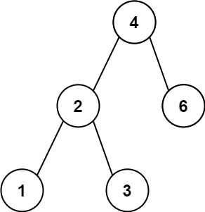
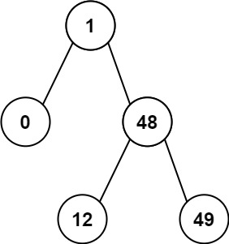

# 530. Minimum Absolute Difference in BST（二叉搜索树的最小绝对差）

[530. Minimum Absolute Difference in BST](https://leetcode.com/problems/minimum-absolute-difference-in-bst/)（[二叉搜索树的最小绝对差](https://leetcode.cn/problems/minimum-absolute-difference-in-bst/)）

Given the `root`​ of a Binary Search Tree (BST), return *the minimum absolute difference between the values of any two different nodes in the tree*.

给你一个二叉搜索树的根节点 `root`​ ，返回 **树中任意两不同节点值之间的最小差值** 。

差值是一个正数，其数值等于两值之差的绝对值。

**Example 1:**

​​

```python
Input: root = [4,2,6,1,3]
Output: 1
```

**Example 2:**

​​

```python
Input: root = [1,0,48,null,null,12,49]
Output: 1
```

# Java

```java
/**
 * Definition for a binary tree node.
 * public class TreeNode {
 *     int val;
 *     TreeNode left;
 *     TreeNode right;
 *     TreeNode() {}
 *     TreeNode(int val) { this.val = val; }
 *     TreeNode(int val, TreeNode left, TreeNode right) {
 *         this.val = val;
 *         this.left = left;
 *         this.right = right;
 *     }
 * }
 */
class Solution {
    private int ans = Integer.MAX_VALUE;
    private TreeNode prev;
    public int getMinimumDifference(TreeNode root) {
        inOrder(root);
        return ans;
    }
    public void inOrder(TreeNode root) {
        if (root == null){
            return;
        } 
        inOrder(root.left);
        if (prev != null) {
            ans = Math.min(ans, root.val - prev.val);
        }   
        prev = root;
        inOrder(root.right);
    }
}
```

# 复杂度分析

* 时间复杂度：O(n)，其中 n 为二叉搜索树节点的个数。每个节点在中序遍历中都会被访问一次且只会被访问一次，因此总时间复杂度为 O(n)。
* 空间复杂度：O(n)。递归函数的空间复杂度取决于递归的栈深度，而栈深度在二叉搜索树为一条链的情况下会达到 O(n) 级别。

‍
