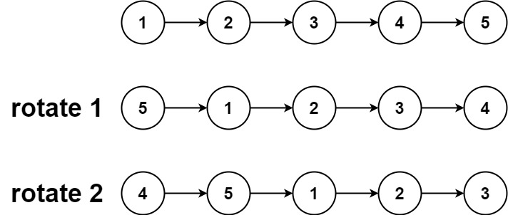
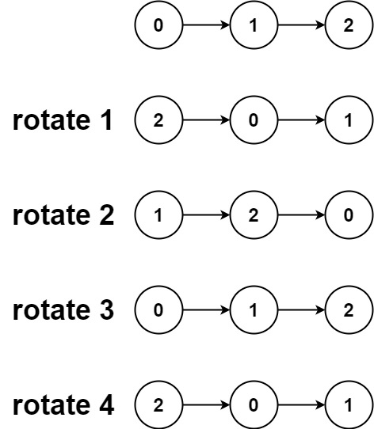

# 61. Rotate List（旋转链表）

[61. Rotate List](https://leetcode.com/problems/rotate-list/)（[旋转链表](https://leetcode.cn/problems/rotate-list/)）

Given the `head`​ of a linked list, rotate the list to the right by `k`​ places.

给你一个链表的头节点 `head`​ ，旋转链表，将链表每个节点向右移动 `k`​  个位置。

**Example 1:**

​​

```java
Input: head = [1,2,3,4,5], k = 2
Output: [4,5,1,2,3]
```

**Example 2:**

​​

```java
Input: head = [0,1,2], k = 4
Output: [2,0,1]
```

# JavaScript

```javascript
/**
 * Definition for singly-linked list.
 * function ListNode(val, next) {
 *     this.val = (val===undefined ? 0 : val)
 *     this.next = (next===undefined ? null : next)
 * }
 */
/**
 * @param {ListNode} head
 * @param {number} k
 * @return {ListNode}
 */
var rotateRight = function(head, k) {
    if(k === 0 || !head || !head.next){
        return head;
    }
    let len= 1, cur = head;
    while(cur.next){
        cur = cur.next;
        len++;
    }
    cur.next = head;
    let i = 0;
    while(i < len - k % len){
        cur = cur.next;
        i++;
    }
    const ret = cur.next
    cur.next = null;
    return ret;
};
```

# Java

```java
class Solution {
    public ListNode rotateRight(ListNode head, int k) {
        if (k == 0 || head == null || head.next == null) {
            return head;
        }
        int n = 1;
        ListNode iter = head;
        while (iter.next != null) {
            iter = iter.next;
            n++;
        }
        int add = n - k % n;
        if (add == n) {
            return head;
        }
        iter.next = head;
        while (add-- > 0) {
            iter = iter.next;
        }
        ListNode ret = iter.next;
        iter.next = null;
        return ret;
    }
}
```

# 复杂度分析

* 时间复杂度：O(n)，最坏情况下，我们需要遍历该链表两次。
* 空间复杂度：O(1)，我们只需要常数的空间存储若干变量。

‍
