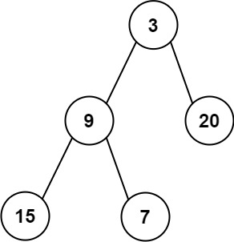

[637. Average of Levels in Binary Tree](https://leetcode.com/problems/average-of-levels-in-binary-tree/)（[二叉树的层平均值](https://leetcode.cn/problems/average-of-levels-in-binary-tree/)）

Given the `root`​ of a binary tree, return *the average value of the nodes on each level in the form of an array*. Answers within ​10​<sup>-5</sup>​ ​of the actual answer will be accepted.

给定一个非空二叉树的根节点 `root`​ , 以数组的形式返回每一层节点的平均值。与实际答案相差 ​10<sup>-5</sup>​​ 以内的答案可以被接受。

**Example 1:**

​​

```java
Input: root = [3,9,20,null,null,15,7]
Output: [3.00000,14.50000,11.00000]
Explanation: The average value of nodes on level 0 is 3, on level 1 is 14.5, and on level 2 is 11.
Hence return [3, 14.5, 11].
```

**Example 2:**

​​

```java
Input: root = [3,9,20,15,7]
Output: [3.00000,14.50000,11.00000]
```

# BFS

## Java

```java
class Solution {
    public List<Double> averageOfLevels(TreeNode root) {
        List<Double> averages = new ArrayList<Double>();
        Queue<TreeNode> queue = new LinkedList<TreeNode>();
        queue.offer(root);
        while (!queue.isEmpty()) {
            double sum = 0;
            int size = queue.size();
            for (int i = 0; i < size; i++) {
                TreeNode node = queue.poll();
                sum += node.val;
                TreeNode left = node.left, right = node.right;
                if (left != null) {
                    queue.offer(left);
                }
                if (right != null) {
                    queue.offer(right);
                }
            }
            averages.add(sum / size);
        }
        return averages;
    }
}
```

## **复杂度分析**

* 时间复杂度：O(n)，其中 n 是二叉树中的节点个数。广度优先搜索需要对每个节点访问一次，时间复杂度是 O(n)。  
  需要对二叉树的每一层计算平均值，时间复杂度是 O(h)，其中 h 是二叉树的高度，任何情况下都满足 h≤n。
* 空间复杂度：O(n)，其中 n 是二叉树中的节点个数。空间复杂度取决于队列开销，队列中的节点个数不会超过 n。

# DFS

## Java

```java
class Solution {
    public List<Double> averageOfLevels(TreeNode root) {
        List<Integer> counts = new ArrayList<Integer>();
        List<Double> sums = new ArrayList<Double>();
        dfs(root, 0, counts, sums);
        List<Double> avgs = new ArrayList<Double>();
        for (int i = 0; i < sums.size(); i++) {
            avgs.add(i, sums.get(i) / counts.get(i));  
        }
        return avgs;
    }
    public void dfs(TreeNode root, int depth, List<Integer> counts, List<Double> sums) {
        if (root == null) return;
        if (depth < sums.size()) {
            sums.set(depth, sums.get(depth) + root.val);
            counts.set(depth, counts.get(depth) + 1);
        } else {
            sums.add(1.0 * root.val);
            counts.add(1);
        }
        dfs(root.left, depth + 1, counts, sums);
        dfs(root.right, depth + 1, counts, sums);
    }
}
```

## 复杂度分析

* 时间复杂度：O(n)，其中 n 是二叉树中的节点个数。深度优先搜索需要对每个节点访问一次，对于每个节点，维护两个数组的时间复杂度都是 O(1)，因此深度优先搜索的时间复杂度是 O(n)。遍历结束之后计算每层的平均值的时间复杂度是 O(h)，其中 h 是二叉树的高度，任何情况下都满足 h≤n。
* 空间复杂度：O(n)，其中 n 是二叉树中的节点个数。空间复杂度取决于两个数组的大小和递归调用的层数，两个数组的大小都等于二叉树的高度，递归调用的层数不会超过二叉树的高度，最坏情况下，二叉树的高度等于节点个数。

‍
