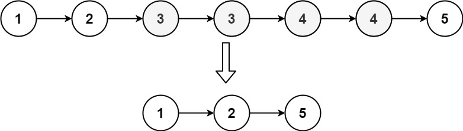

[82. Remove Duplicates from Sorted List II](https://leetcode.com/problems/remove-duplicates-from-sorted-list-ii/)（[删除排序链表中的重复元素 II](https://leetcode.cn/problems/remove-duplicates-from-sorted-list-ii/)）

Given the `head`​ of a sorted linked list, *delete all nodes that have duplicate numbers, leaving only distinct numbers from the original list*. Return *the linked list* ***sorted*** *as well*.

给定一个已排序的链表的头 `head`​ ， *删除原始链表中所有重复数字的节点，只留下不同的数字* 。返回 *已排序的链表* 。

**Example 1:**

​​

```java
Input: head = [1,2,3,3,4,4,5]
Output: [1,2,5]
```

**Example 2:**

​​

```java
Input: head = [1,1,1,2,3]
Output: [2,3]
```

# JavaScript

```javascript
/**
 * Definition for singly-linked list.
 * function ListNode(val, next) {
 *     this.val = (val===undefined ? 0 : val)
 *     this.next = (next===undefined ? null : next)
 * }
 */
/**
 * @param {ListNode} head
 * @return {ListNode}
 */
var deleteDuplicates = function(head) {
    if(!head) {
        return null;
    }
    const dummy = new ListNode(0, head);
    let cur = dummy;
    while(cur.next && cur.next.next){
        if(cur.next.val === cur.next.next.val){
            let dup = cur.next.val;
            while(cur.next && cur.next.val === dup){
                cur.next = cur.next.next;
            }
        }else{
            cur = cur.next;
        }
    }
    return dummy.next
};
```

# Java

```java
class Solution {
    public ListNode deleteDuplicates(ListNode head) {
        ListNode dummy = new ListNode(0, head), cur = dummy;
        while (cur.next != null && cur.next.next != null) {
            int val = cur.next.val;
            if (cur.next.next.val == val)
                while (cur.next != null && cur.next.val == val)
                    cur.next = cur.next.next;
            else
                cur = cur.next;
        }
        return dummy.next;
    }
}
```

# 复杂度分析

* 时间复杂度：O(n)，其中 n 为链表的长度。
* 空间复杂度：O(1)，仅用到若干额外变量。

‍
