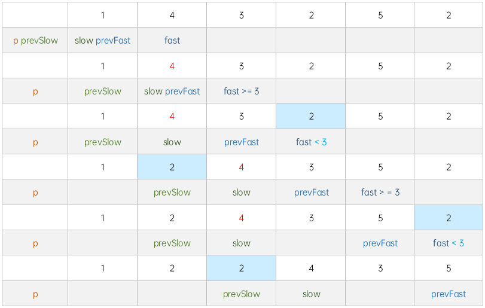

[86. Partition List](https://leetcode.com/problems/partition-list/)（[分隔链表](https://leetcode.cn/problems/partition-list/)）

# 方法一：链头

​`<`​目标值放链表`a`​，`>=`​放链表`b`​，拼接链表`a`​和`b`​  
**头部节点不确定**时，用**虚拟链头**指向头部。拼接和返回`虚拟链头.next`​即可

## JavaScript

```javascript
/**
 * Definition for singly-linked list.
 * function ListNode(val, next) {
 *     this.val = (val===undefined ? 0 : val)
 *     this.next = (next===undefined ? null : next)
 * }
 */
/**
 * @param {ListNode} head
 * @param {number} x
 * @return {ListNode}
 */
var partition = function(head, x) {
    let pA = a = new ListNode(0), pB = b = new ListNode(0);
    while(head){
        head.val < x ? a = a.next = head : b = b.next = head;
        head = head.next;
    }
    a.next = pB.next;
    b.next = null;
    return pA.next;
};
```

## Java

```java
public class Solution {
    public ListNode partition(ListNode head, int x) {
        ListNode pA = new ListNode(0), a = pA;
        ListNode pB = new ListNode(0), b = pB;
      
        while (head != null) {
            if (head.val < x) {
                a.next = head;
                a = a.next;
            } else {
                b.next = head;
                b = b.next;
            }
            head = head.next;
        }
      
        a.next = pB.next;
        b.next = null;
      
        return pA.next;
    }
}
```

## 复杂度分析

* 时间复杂度: O(n)，其中 n 是原链表的长度。我们对该链表进行了一次遍历。
* 空间复杂度: O(1)。

# 方法二：数组

​`<`​目标值放数组`a`​，`>=`​放数组`b`​，拼接数组`a`​和`b`​

## JavaScript

```javascript
var partition = function(head, x) {
    let a = [], b = [], i = 0;
    while (head) {
        head.val < x ? a.push(head) : b.push(head);
        head = head.next;
    }
    if (a.length === 0) return b[0] || head;
    while (++i <= a.length) a[i - 1].next = a[i] || b[0] || null;
    for (i = 1; i <= b.length; i++) b[i - 1].next = b[i] || null;
    return a[0];
};
```

## 复杂度分析

* 时间复杂度: O(n)，遍历列表一次，将节点划分为两个数组，再遍历一次，重新组装列表。
* 空间复杂度: O(n)，数组a和b使用了额外的空间，每个数组可以容纳n个节点。

# 方法三：双指针

* 慢指针只在`<`​目标值移动，快指针始终移动
* 慢指针停在`>=`​目标值时，如果快指针`<`​目标值，移动快指针节点到慢指针节点前

  * 删除：快指针`上节点`​ → 快指针`下节点`​
  * 插入：慢指针`上节点`​ ​→​ 快指针`节点`​ ​→​ 慢指针`节点`​

## JavaScript

```javascript
var partition = function(head, x) {
    if (head === null) return null;
    let p = prevSlow = new ListNode(0), prevFast = slow = head, fast = head.next;
    prevSlow.next = head;
    while (fast) {
        if (slow.val < x) {
            prevSlow = slow;
            slow = slow.next;
            prevFast = fast;
        } else if (fast.val < x) {
            prevFast.next = fast.next;
            prevSlow.next = fast;
            fast.next = slow;
            prevSlow = fast;
        } else prevFast = fast;
        fast = prevFast.next;
    }
    return p.next;
};
```

​​

## 复杂度分析

* 时间复杂度: O(n)，其中 n 是原链表的长度。我们对该链表进行了一次遍历。
* 空间复杂度: O(1)。

# 方法四：双指针 · 优化

原双指针代码中，用`prevSlow.next`​代替`slow`​ `head`​代替`prevFast`​ 再将`prevSlow`​写成`slow`​

## JavaScript

```javascript
var partition = function(head, x) {
    if (head === null) return null;
    let p = slow = new ListNode(0), fast = head.next;
    slow.next = head;
    while (fast) {
        if (slow.next.val < x) {
            slow = slow.next;
            head = fast;
        } else if (fast.val < x) {
            head.next = fast.next;
            fast.next = slow.next;
            slow = slow.next = fast;
        } else head = fast;
        fast = head.next;
    }
    return p.next;
};
```

## 复杂度分析

* 时间复杂度: O(n)，其中 n 是原链表的长度。我们对该链表进行了一次遍历。
* 空间复杂度: O(1)。

# 方法五：Fiber

​`React Fiber`​：`>=`​目标值`节点`​放入`tag`​链表并从原链表删除。拼接原链表最后节点和`tag`​

## JavaScript

```javascript
var partition = function(head, x) {
    let p = prev = new ListNode(0), pTag = tag = new ListNode(0);
    prev.next = head;
    while (head) {
        if (head.val >= x) {
            prev.next = head.next;
            tag = tag.next = head;
        } else prev = head;
        head = head.next;
    }
    tag.next = null;
    prev.next = pTag.next;
    return p.next;
}
```

## 复杂度分析

* 时间复杂度: O(n)，其中 n 是原链表的长度。我们对该链表进行了一次遍历。
* 空间复杂度: O(1)。
