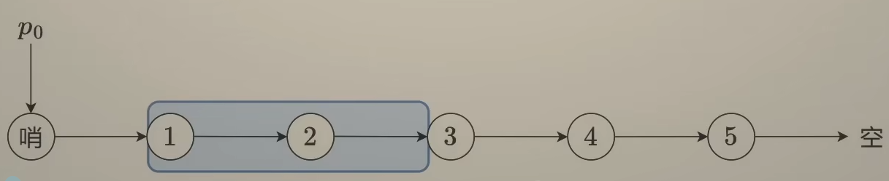
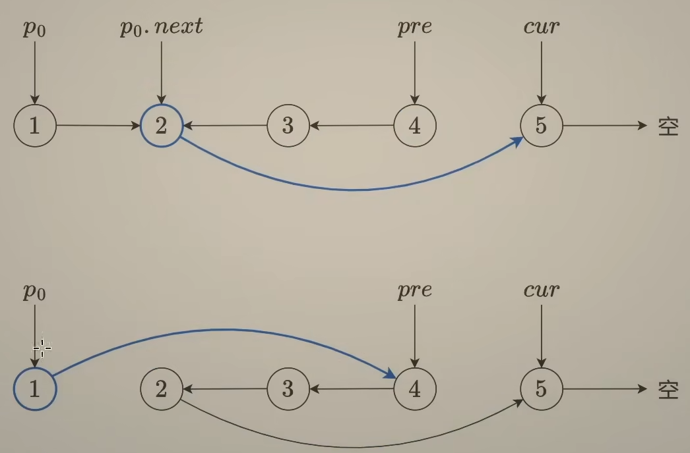

# 92. Reverse Linked List II（反转链表 II）

[92. Reverse Linked List II](https://leetcode.com/problems/reverse-linked-list-ii/)（[反转链表 II](https://leetcode.cn/problems/reverse-linked-list-ii/)）

Given the `head`​ of a singly linked list and two integers `left`​ and `right`​ where `left <= right`​, reverse the nodes of the list from position `left`​ to position `right`​, and return *the reversed list*.

给你单链表的头指针 `head`​ 和两个整数 `left`​ 和 `right`​ ，其中 `left <= right`​ 。请你反转从位置 `left`​ 到位置 `right`​ 的链表节点，返回 **反转后的链表** 。

**Example 1:**

​​

```java
Input: head = [1,2,3,4,5], left = 2, right = 4
Output: [1,4,3,2,5]
```

**Example 2:**

```java
Input: head = [5], left = 1, right = 1
Output: [5]
```

​​

​​

# JavaScript

```javascript
/**
 * Definition for singly-linked list.
 * function ListNode(val, next) {
 *     this.val = (val===undefined ? 0 : val)
 *     this.next = (next===undefined ? null : next)
 * }
 */
/**
 * @param {ListNode} head
 * @param {number} left
 * @param {number} right
 * @return {ListNode}
 */
var reverseBetween = function(head, left, right) {
    let dummy = new ListNode(0, head);
    let p = dummy;
    for (let i = 0; i < left - 1; i++){
        p = p.next;
    }
    let pre = null, cur = p.next;
    for (let i = 0; i < right - left + 1; i++){
        const nxt = cur.next;
        cur.next = pre;
        pre = cur;
        cur = nxt;
    }
    p.next.next = cur;
    p.next = pre;
    return dummy.next;
};
```

# Java

```java
class Solution {
    public ListNode reverseBetween(ListNode head, int left, int right) {
        ListNode dummy = new ListNode(0, head), p0 = dummy;
        for (int i = 0; i < left - 1; ++i)
            p0 = p0.next;

        ListNode pre = null, cur = p0.next;
        for (int i = 0; i < right - left + 1; ++i) {
            ListNode nxt = cur.next;
            cur.next = pre;
            pre = cur;
            cur = nxt;
        }

        p0.next.next = cur;
        p0.next = pre;
        return dummy.next;
    }
}

```

# 复杂度分析

* 时间复杂度：O(n)，其中 n 为链表节点个数。
* 空间复杂度：O(1)，仅用到若干额外变量。
