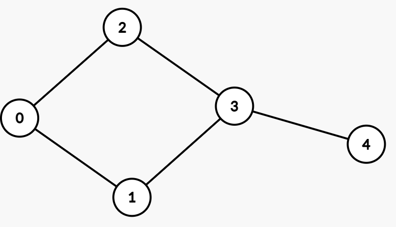
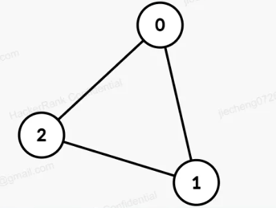

# Q1

## Description

The developers working on a social media network app want to analyze user behavior. There are n event logs where *userEvent[i*] denotes the *userld* for the user that triggered the *i*​<sup>*th*</sup> event. The team wants to analyze the subarrays of the logs which are consistent, that is, the frequency of the most frequent user in the subarray is equal to the frequency of the least frequent user in the whole array. Find the maximum length of consistent logs.

Note:

* A subarray is a contiguous group of elements in an array.

‍

**Example**

Given n = 10, and userEvent = [1, 2, 1, 3, 4, 2, 4, 3, 3, 4]

* The frequencies of 1 and 2 are 2.
* The frequencies of 3 and 4 are 3.

The minimum frequency in the array is 2.

The longest valid subarray has 8 elements: [1, 2, 1, 3, 4, 2, 4, 3]

* The frequencies of 1, 2, 3 and 4 are all 2.

The frequency of the most common element in the subarray is 2, the same as the minimum frequency in the entire array.

‍

**Function Description**

Complete the function *findConsistentLogs* in the editor below.

‍

*findConsistentLogs* has the following parameters:

	*int userEvnet[n]:*  the userIds present in the event logs

‍

**Returns**

	*int:*  the maximum length of consistent logs

‍

**Constraints**

* *1 ≤ n ≤ 3×10*​<sup>*5*</sup>
* *1 ≤ userEvent[i] ≤ 10*​<sup>*9*</sup>

‍

## Sample

### **Input Format For Custom Testing**

The first line contains an integer *n*, the number of elements in the *userEvent*.

Each line *i* of the *n* subsequent lines (where *0 ≤ i &lt; n*) contains an integer, *userEvent[i]* .

‍

### Sample Case 0

**Sample Input For Custom Testing**

```python
STDIN		Function
-----		--------
3		->	userEvent[] size n = 3
9		->	userEvent = [9, 9, 9]
9
9
```

**Sample Output**

```python
3
```

**Explanation**

The consistent logs are [9, 9, 9] because both the frequency of the least frequent user in the entire array and the frequency of the most frequent user in the subarray is 3.

‍

### Sample Case 1

**Sample Input For Custom Testing**

```python
STDIN		Function
-----		--------
5		->	userEvent[] size n = 5
9		->	userEvent = [9, 8, 5, 9, 2]
8
5
9
2
```

**Sample Output**

```python
4
```

**Explanation**

The consistent logs are [9, 9, 9] because both the frequency of the least frequent user in the entire array and the frequency of the most frequent user in the subarray is 3.

‍

## Code

```python
from collections import Counter

def findConsistentLogs(userEvent):
    n = len(userEvent)
  
    # Find the minimum frequency in the entire array
    freq_count = Counter(userEvent)
    min_freq = min(freq_count.values())
  
    # Initialize variables for sliding window
    max_length = 0
    start = 0
    window_freq = Counter()
  
    for end in range(n):
        # Expand the window
        window_freq[userEvent[end]] += 1
      
        # Shrink the window if necessary
        while max(window_freq.values()) > min_freq:
            window_freq[userEvent[start]] -= 1
            if window_freq[userEvent[start]] == 0:
                del window_freq[userEvent[start]]
            start += 1
      
        # Update max_length
        max_length = max(max_length, end - start + 1)
  
    return max_length
```

‍

# Q2

## Description

Implement a prototype of a friend recommendation system for a social media application.

There are n users indexed from *0* to *n-1*, and *m* friends represented as a 2d array, *friendships*, where the i<sup>th</sup>  friendship is a connection between users *friendships[i][0]*  and *friendships[i][1]* .

User *x* is suggested as a friend to user *y* if *x* and *y* are not friends and have the maximum number of *common friends*, i.e. a friend of both x and y. If there are multiple possible such users x, the one with the minimum index is suggested.

Given *n* and *friendships* ,for each of the *n* users, find the index of the friend that should be recommended to them. If there is no recommendation available, report -1.

**Example**  
Suppose *n = 5, m = 5*, and c*onnections* =[[0,1], [0,2], [1,3], [2,3], [3,4]]

​​

|User|Max Common Friends With|Recommendation|
| ------| -------------------------| -------------------|
|0|3 (1, 2)|3|
|1|2 (0, 3)|2|
|2|1 (0, 3)|1|
|3|0 (1, 2)|0|
|4|2 (3), 1 (3)|1 (minimum Index)|

Hence the answer returned is [3, 2, 1, 0, 1].

‍

**Function Description**

Complete the function *getRecommendedFriends* in the editor below.

‍

*getRecommendedFriends* has the following parameters:

	*int n:*  the number of users

	*int friendships[m][2]:*  the friendships between the users

‍

**Constraints**

* *1 ≤ n ≤ 10*​<sup>*5*</sup>
* *0 ≤ m ≤ 2.5 × 10*​<sup>*5*</sup>
* *0 ≤ friendships[i][0], friendships[i][1] &lt; n*
* There are no self-loops or multiple edges.
* Each user has a maximum of 15 friends.
* The network of friends might be disconnected.

‍

## Sample

### Input Format For Custom Testing

The first line contains an integer, *n*.

The next line contains an integer, *m*, the size of friendships.

The next line contains a constant integer, 2, the size of *friendships[i]* .

Each line *i* of the *m* subsequent lines contains two integers *friendships[i][0]*  and *friendships[i][1]* .

‍

### Sample Case 0

**Sample Input For Custom Testing**

```python
STDIN		Function
-----		--------
3		->	n = 3
3		->	m = 3
2
0 1		->	friendships = [[0, 1], [1, 2], [2, 0]]
1 2
2 0
```

**Sample Output**

```python
-1
-1
-1
```

**Explanation**

​​

‍

## Code

```python
def getRecommendedFriends(n, friendships):
    # Create adjacency list
    graph = [set() for _ in range(n)]
    for u, v in friendships:
        graph[u].add(v)
        graph[v].add(u)
  
    def get_recommendation(user):
        max_common = -1
        recommendation = -1
        for potential_friend in range(n):
            if potential_friend != user and potential_friend not in graph[user]:
                common_friends = len(graph[user] & graph[potential_friend])
                if common_friends > max_common or (common_friends == max_common and potential_friend < recommendation):
                    max_common = common_friends
                    recommendation = potential_friend
        return recommendation

    return [get_recommendation(user) for user in range(n)]

```

‍
