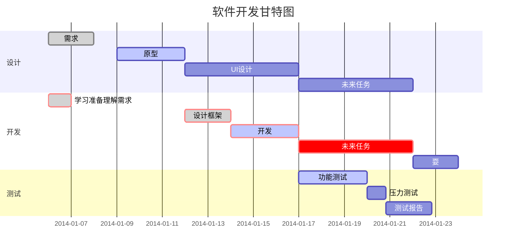
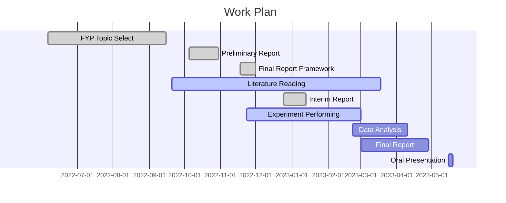
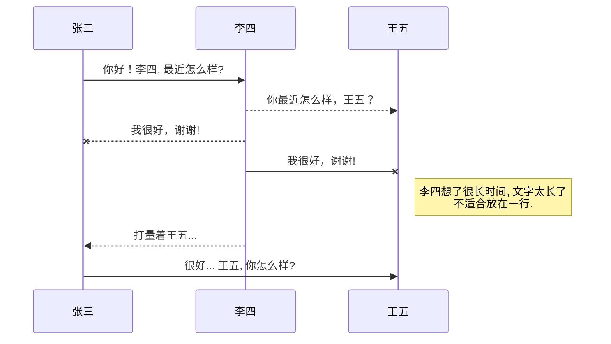
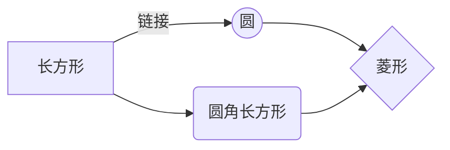

# 标题


```c
# 一级标题
## 二级标题
### 三级标题
#### 四级标题
##### 五级标题
###### 六级标题
```

# 一级标题
## 二级标题
### 三级标题
#### 四级标题
##### 五级标题
###### 六级标题


# 分割线

```c
//分割线表示
***
---
___
<hr style="border:1px solid red;">
```

***
---
___
<hr style="border:1px solid red;">

# 字体

## 字体类型和颜色
``` c
<font face="kaiti">这里是楷体</font>
<font face="heiti">这里是黑体</font>
<font face="simsun">这里是宋体</font>
<font face="Arial">This is Arial</font>
<font face="Arial Narrow">This is Arial Narrow</font>
<font face="Times New Roman">This is Times New Roman</font>
<font face="Calibri">This is Calibri</font>
<font color="red"><b>红色加粗</b></font>
<font style="background: linear-gradient( to right，#ff1616，#ff7716，#ffdc16,#36c945，#10a5ce，#Of0096，#a51eff，#ff1616); ">这是七色光彩背景颜色</font>
```

<font face="kaiti">这里是楷体</font>
<font face="heiti">这里是黑体</font>
<font face="simsun">这里是宋体</font>
<font face="幼圆">这里是幼圆</font>
<font face="华文彩云">这里是华文彩云</font>
<font face="Arial">This is Arial</font>
<font face="Arial Narrow">This is Arial Narrow</font>
<font face="Times New Roman">This is Times New Roman</font>
<font face="Calibri">This is Calibri</font>
<font color="red"><b>红色加粗</b></font>
<font style="background: linear-gradient( to right, #ff1616, #ff7716, #ffdc16, #36c945, #10a5ce, #Of0096, #a51eff, #ff1616); ">这是七色光彩背景颜色</font>

## 其他
```c
==高亮==
~~删除线~~
**粗**__体__
*斜体*
***粗***__*斜*__*__体__*
<u>下划线</u>
:smile:
$\theta=x^2$
```

==高亮==
~~删除线~~
**粗**__体__
*斜体*
***粗***__*斜*__*__体__*
<u>下划线</u>
😄
[emoji链接](https://unicode.org/emoji/charts/full-emoji-list.html)
$\theta=x^2$

# 引用

```c
//一级引用用一个>来表示
//二级引用用两个>来表示
//三级引用用三个>来表示
```

> 一级引用

>>二级引用

> > >三级引用


# 脚注

```c
一键三连[^1]
```

一键三连[^1]

[^1]:点赞、投币、收藏

# 列表
## 有序列表
```c
//有序列表
## 有序列表
1. 有序列表1
2. 有序列表2
3. 有序列表3
    1. 子序列1
    2. 子序列2
    3. 子序列3
```

1. 有序列表1
2. 有序列表2
1. 有序列表3
    1. 子序列1
    2. 子序列2
    3. 子序列3

## 无序列表

```c
//无序列表
## 无序列表
* 无序列表1
+ 无序列表2
  - [ ] 子序列1
  - [ ] 子序列2
  - [x] 子序列3
- 无序列表3
    - 子序列1
    + 子序列2
    * 子序列3

```

* 无序列表1
+ 无序列表2
  - [ ] 子序列1
  - [ ] 子序列2
  - [x] 子序列3
- 无序列表3
    - 子序列1
    + 子序列2
    * 子序列3


# 数学公式

```c
$$
\frac{partial f}{\partial x} = \sqrt[3]{a_1}x  
$$

$$
\Gamma(z) = \int_0^\infty t^{z-1}e^{-t}dt \tag{2}
$$

$$
\lim_{a\to\infty}a=\infty\lim_{b\rightarrow-\infty}=-\infty \tag{3}
$$
    
$$
x(t)=\sum_{k=-\infty}^{\infty}a_ke^{jkw_0t} \tag{4}
$$
```

$$
\frac{\partial f}{\partial x} = \sqrt[3]{a_1}x \tag{1}
$$

$$
\Gamma(z) = \int_0^\infty t^{z-1}e^{-t}dt \tag{2}
$$

$$
\lim_{a\to\infty}a=\infty\lim_{b\rightarrow-\infty}=-\infty \tag{3}
$$

$$
x(t)=\sum_{k=-\infty}^{\infty}a_ke^{jkw_0t} \tag{4}
$$


```c
$$
\vec{F}=ma\\
\leq\\
\geq
$$
```

$$
\vec{F}=ma\\
a\leq b\\
b\geq c
$$

## 希腊字母

```c
$$
\alpha, \beta, \gamma, \delta, \epsilon\\
\varepsilon, \eta, \theta, \vartheta, \kappa\\
\pi, \rho,\lambda, \mu, \phi\\
\varphi, \omega, \tau, \psi, \Psi\\
\xi,\iota, \zeta, \nu, \upsilon\\
\sigma, \chi, \O, \Xi, \Upsilon
$$
```


$$
\alpha, \beta, \gamma, \delta, \epsilon\\
\varepsilon, \eta, \theta, \vartheta, \kappa\\
\pi, \rho,\lambda, \mu, \phi\\
\varphi, \omega, \tau, \psi, \Psi\\
\xi,\iota, \zeta, \nu, \upsilon\\
\sigma, \chi, \O, \Xi, \Upsilon
$$


## 矩阵

```c
$$
\begin{Bmatrix}
   a & b \\
   c & d
\end{Bmatrix} \tag{1}
$$
```

$$
\begin{Bmatrix}
	a & b \\
	c & d
\end{Bmatrix} \tag{1}
$$


```c
$$
\begin{bmatrix}
a & b\\
c & d
\end{bmatrix} \tag{2}
$$
```

$$
\begin{bmatrix}
a & b\\
c & d
\end{bmatrix} \tag{2}
$$


```c
$$
\begin{vmatrix}
a & b\\
c & d
\end{vmatrix} \tag{3}
$$
```

$$
\begin{vmatrix}
a & b\\
c & d
\end{vmatrix} \tag{3}
$$


```c
$$
\left\{
\begin{matrix}
1 & 2 & 3\\
4 & 5 & 6\\
7 & 8 & 9
\end{matrix}
\right\} \tag{4}
$$
```

$$
\left\{
\begin{matrix}
1 & 2 & 3\\
4 & 5 & 6\\
7 & 8 & 9
\end{matrix}
\right\} \tag{4}
$$


```c
$$
\left[
\begin{matrix}
1 & 2 & 3\\
4 & 5 & 6\\
7 & 8 & 9
\end{matrix}
\right] \tag{5}
$$
```

$$
\left[
\begin{matrix}
1 & 2 & 3\\
4 & 5 & 6\\
7 & 8 & 9
\end{matrix}
\right] \tag{5}
$$


```c
$$
\left(
\begin{matrix}
1 & 2 & 3\\
4 & 5 & 6\\
7 & 8 & 9
\end{matrix}
\right) \tag{6}
$$
```


$$
\left(
\begin{matrix}
1 & 2 & 3\\
4 & 5 & 6\\
7 & 8 & 9
\end{matrix}
\right) \tag{6}
$$


```c
$$
\begin{Bmatrix}
1 & 2 & \cdots & 5\\
6 & 7 & \cdots & 10\\
\vdots & \vdots & \ddots & \vdots\\
\alpha & \alpha+1 & \cdots & \alpha+4
\end{Bmatrix}\tag{7}
$$
```

$$
\begin{Bmatrix}
1 & 2 & \cdots & 5\\
6 & 7 & \cdots & 10\\
\vdots & \vdots & \ddots & \vdots\\
\alpha & \alpha+1 & \cdots & \alpha+4
\end{Bmatrix}\tag{7}
$$


## 多行等式对齐

```c
$$
\begin{aligned}
a &= b + c \\
  &= d + e + f
\end{aligned}
$$
```


$$
\begin{aligned}
a &= b + c \\
  &= d + e + f
\end{aligned}
$$


## 方程组、条件表达式

```c
$$
\begin{cases}
3x + 5y +  z \\
7x - 2y + 4z \\
-6x + 3y + 2z
\end{cases}   
$$
```


$$
\begin{cases}
3x + 5y +  z \\
7x - 2y + 4z \\
-6x + 3y + 2z
\end{cases}
$$


```c
$$
f(n) =
\begin{cases} 
n/2,  & \text{if }n\text{ is even} \\
3n+1, & \text{if }n\text{ is odd}
\end{cases}
$$
```


$$
f(n) =
\begin{cases} 
n/2,  & \text{if }n\text{ is even} \\
3n+1, & \text{if }n\text{ is odd}
\end{cases}
$$


## 间隔

```c
//紧贴 + 无空格 + 小空格 + 中空格 + 大空格 + 真空格 + 双真空格
$$
a\!b + ab + a\,b + a\;b + a\ b + a\quad b + a\qquad b
$$
```


$$
a\!b + ab + a\,b + a\;b + a\ b + a\quad b + a\qquad b
$$


## 表格

### 简易表格

```c
$$
\begin{array}{|c|l|r|}
	\hline 1&20&3000\\
	\hline 40&500&60000\\
	\hline 7000&80000&9000000\\
	\hline
\end{array}
$$
```


$$
\begin{array}{|c|l|r|}
	\hline 1&20&3000\\
	\hline 40&500&60000\\
	\hline 7000&80000&9000000\\
	\hline
\end{array}
$$


### 真值表

```c
$$
\begin{array}{cc|c}
	       A&B&F\\
	\hline 0&0&0\\
	       0&1&1\\
	       1&0&1\\
	       1&1&1\\
\end{array}
$$
```


$$
\begin{array}{cc|c}
	       A&B&F\\
	\hline 0&0&0\\
	       0&1&1\\
	       1&0&1\\
	       1&1&1\\
\end{array}
$$


# 甘特图


```c






# 超链接

```c
[B站](https://www.bilibili.com)
     
[原神](./QQ截图20220110160242.png)
     
[【静止画MAD】FRIEND(https://i0.hdslb.com/bfs/archive/3fb28cc5eef41d048083c48e7539bdf9a7864440.jpg@560w_350h_100Q_1c.webp)

[【静止画MAD】FRIEND](https://www.bilibili.com/video/BV1uL411W7HT)
 
<iframe src="https://player.bilibili.com/player.html?aid=461536590&bvid=BV1uL411W7HT&cid=368370249&p=1" scrolling="no" border="0" frameborder="no" framespacing="0" allowfullscreen="true" &danmaku="1" width="90%" height="360"> </iframe>


```


[B站](https://www.bilibili.com)

[【静止画MAD】FRIEND](https://i0.hdslb.com/bfs/archive/3fb28cc5eef41d048083c48e7539bdf9a7864440.jpg@560w_350h_100Q_1c.webp)

[【静止画MAD】FRIEND](https://www.bilibili.com/video/BV1uL411W7HT)


<iframe src="https://player.bilibili.com/player.html?aid=461536590&bvid=BV1uL411W7HT&cid=368370249&p=1" scrolling="no" border="0" frameborder="no" framespacing="0" allowfullscreen="true" &danmaku="1" width="90%" height="360"> </iframe>


# 图片

```c
//在线图片


//本地图片

 
```


# 代码块

```c
`printf()`
```

`printf()`

```c
#include<stdio.h>
int main(){
    printf("hello world!");
    return 0;
}
```


# UML 图表

````c
//下面是一个序列图

````


```c
//下面是一个流程图



- 关于 **Mermaid** 语法，参考 [这儿](https://mermaidjs.github.io/),


# Flowchart流程图

```c
//标准流程图源码格式
st=>start: 开始框
op=>operation: 处理框
cond=>condition: 判断框(是或否?)
sub1=>subroutine: 子流程
io=>inputoutput: 输入输出框
e=>end: 结束框
st->op->cond
cond(yes)->io->e
cond(no)->sub1(right)->op
```


```flow
st=>start: 开始框
op=>operation: 处理框
cond=>condition: 判断框(是或否?)
sub1=>subroutine: 子流程
io=>inputoutput: 输入输出框
e=>end: 结束框
st->op->cond
cond(yes)->io->e
cond(no)->sub1(right)->op
```


```c
//标准流程图源码格式（横向）
st=>start: 开始框
op=>operation: 处理框
cond=>condition: 判断框(是或否?)
sub1=>subroutine: 子流程
io=>inputoutput: 输入输出框
e=>end: 结束框
st(right)->op(right)->cond
cond(yes)->io(bottom)->e
cond(no)->sub1(right)->op
```

```flow
st=>start: 开始框
op=>operation: 处理框
cond=>condition: 判断框(是或否?)
sub1=>subroutine: 子流程
io=>inputoutput: 输入输出框
e=>end: 结束框
st(right)->op(right)->cond
cond(yes)->io(bottom)->e
cond(no)->sub1(right)->op
```

