图床就是将你的本地图片上传到相关服务商或者个人服务器，然后获取图片对应的网络访问地址，使用者可以方便快速的将图片插入到文章中，后续图片二次使用、迁移、分享都会非常简单。这里主要介绍我的个人方案。

## Github

### 创建 Github 新仓库

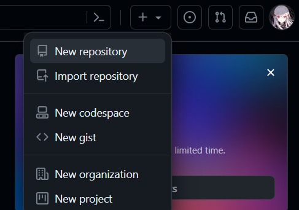​

一定要勾选 public，不然别人看不到图，然后建议加一个 README 文件。

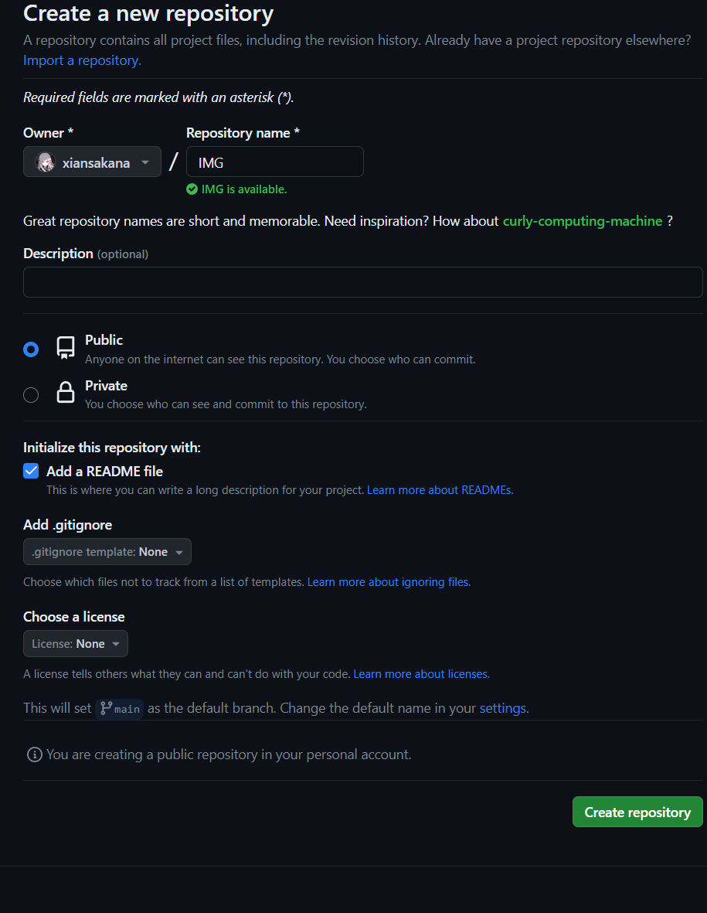​

看到如下界面就说明图床已经创建好了，接下来就是上传图片了。

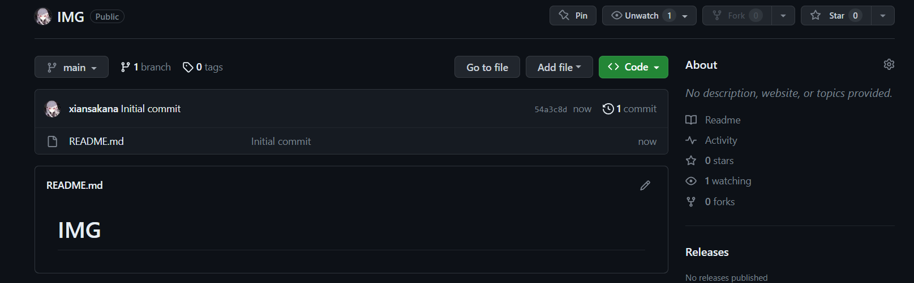

### 下载 PicGo

推荐使用一个开源图床工具  [PicGo](https://molunerfinn.com/PicGo/)  来作为我们的图片上传工具，打开链接的官网后点击免费下载后会跳转到 Github 的界面。

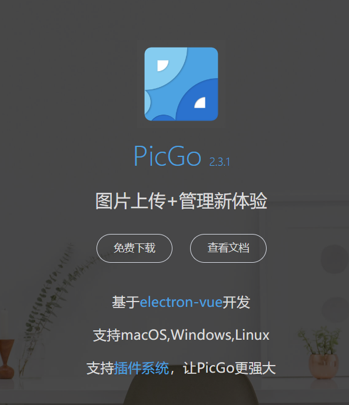

一般前几个是 beta 版本，也就是测试版本，所以我们选择后面的正式版。


在所需下载版本的最后的 assets 中选择对应的系统版本，windows 系统 32 位就选 ia32，64 位就选 x64，或者直接直接选下面那个 setup exe 的，ios 系统选 dmg。

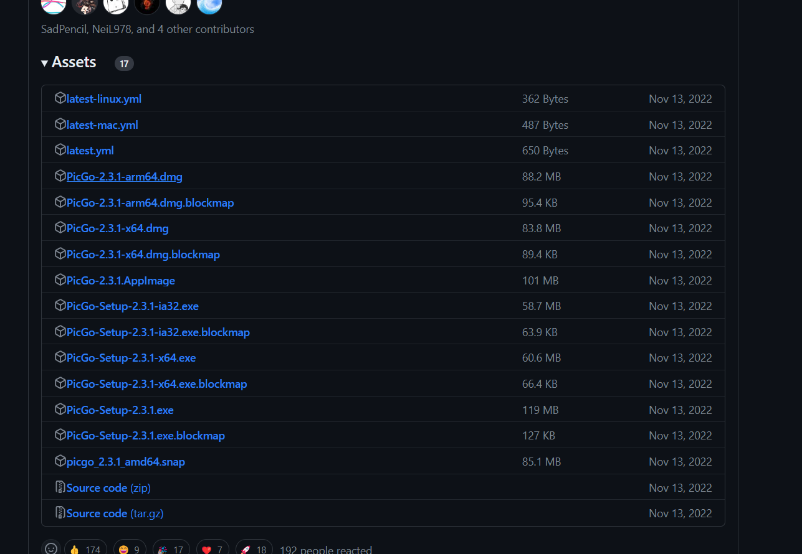

安装之后软件的界面大概是这样。

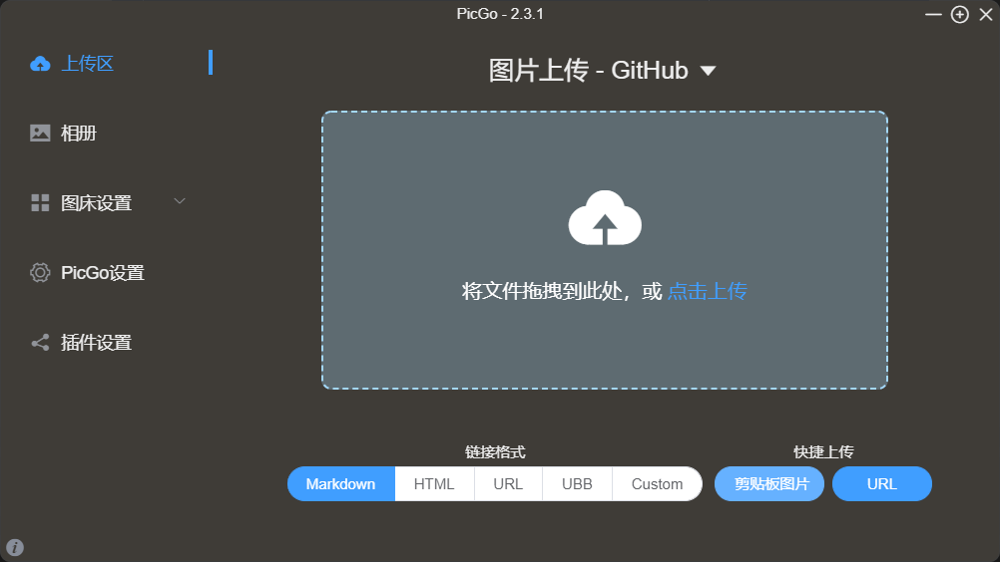

### 创建 Github token

在 Github 里打开 Settings

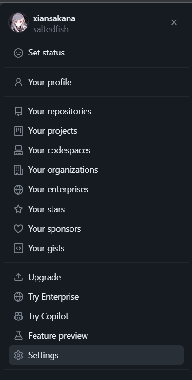

然后翻到最下面左侧选择 Developer settings

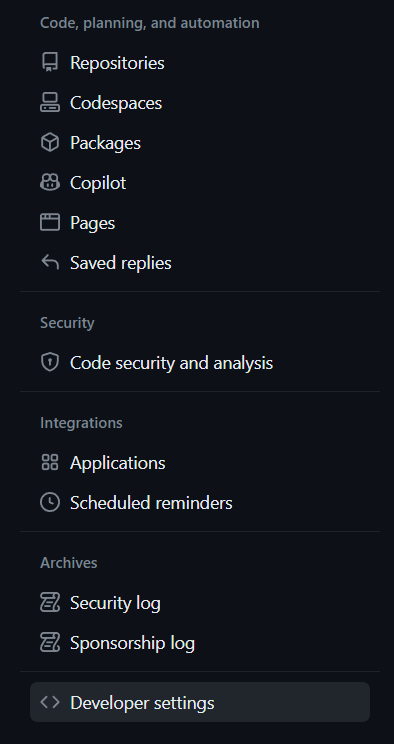

进入 Developer settings 后选择左边 Personal access tokens 里的的 tokens (classic)，最后点击 Generate new token (classic)。

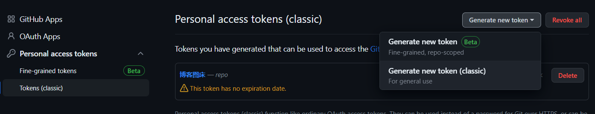

填写用途，我选择的是永不过期，并勾选 repo，然后点 Generate token 即可

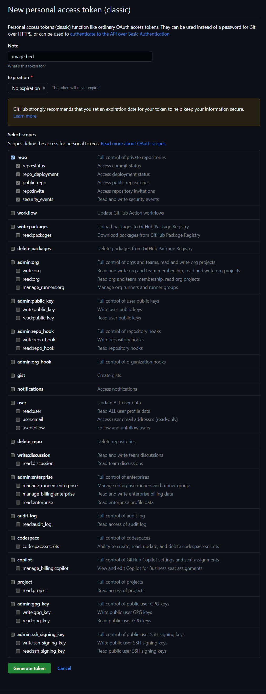

这个 token 只会显示一次，所以最好把它复制下来存好，方便下次使用，否则下次有需要重新新建。我的话直接在 Github 上新建一个 private 库来存这个 token，这样想用也能随时找到。

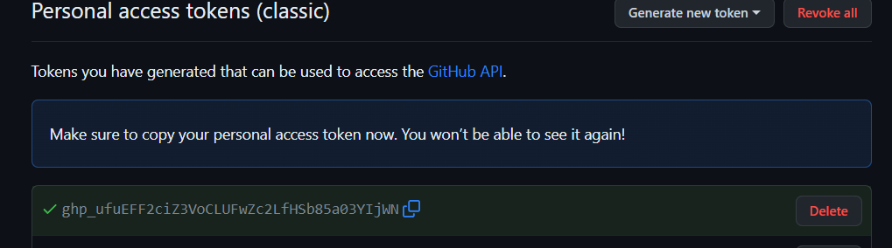

### 配置 PicGo

打开 PicGo，选择图床设置中的 GitHub 然后设置如下，其中仓库名是刚刚创建的仓库，分支名一般是 main，Token 就是刚刚生成的那个，最后点击确定。

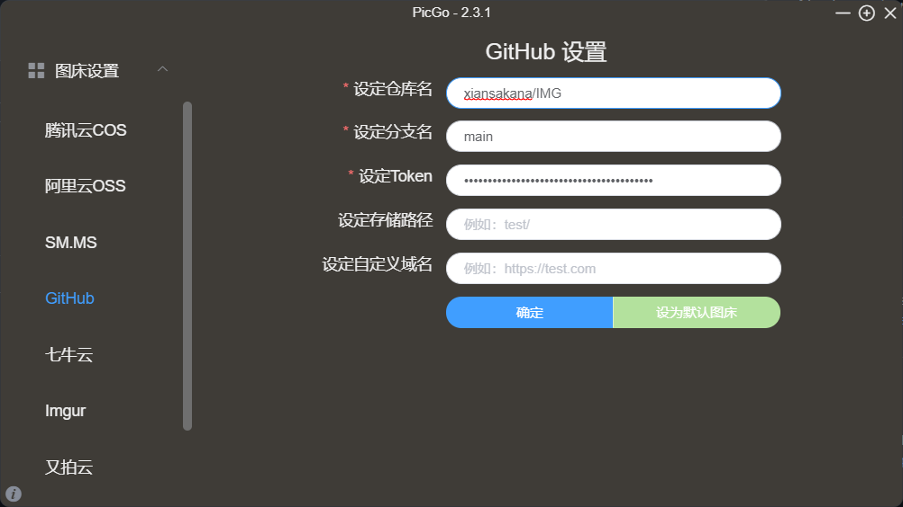

我一般直接选择 qq 或者 snipaste 截图然后直接剪切板图片快捷上传，或者直接拖动图片上传。

​

也可以通过快捷键上传，默认为 ctrl + shift +P。

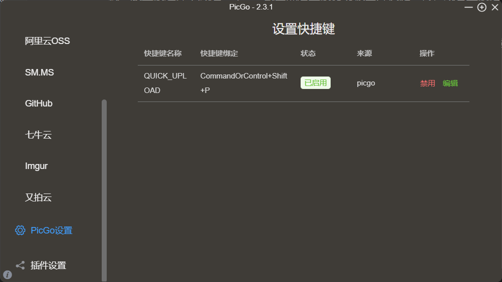

如果在国内的话 Github 图片访问可能会很慢，所以这时候我们就可以用  [jsDelivr](https://www.jsdelivr.com/")  进行免费加速，而设置的方法也很简单，只需要在我们 PicGo 图床配置中添加如下自定义域名即可

> https://cdn.jsdelivr.net/gh/用户名/仓库名

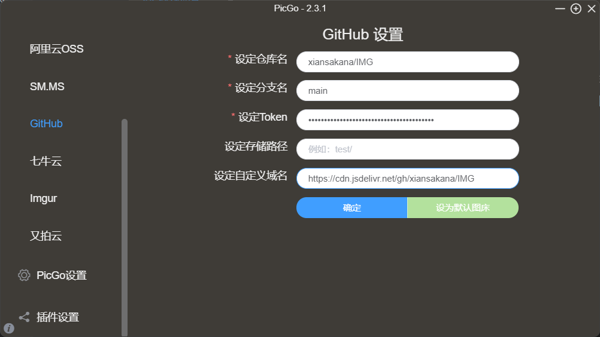

## NPM

### 注册账号

首先访问[npm 注册页面](https://www.npmjs.com/signup/)，注册一个 npm 的账号。

### 完成验证

注册完成后进入账号管理界面:头像->Account，你会看到`Two-Factor Authentication`的栏目，点击以后按提示步骤完成双重验证，这里我选择的是 app，下载一个 google 或者 microsoft 的 Authenticator 就行。

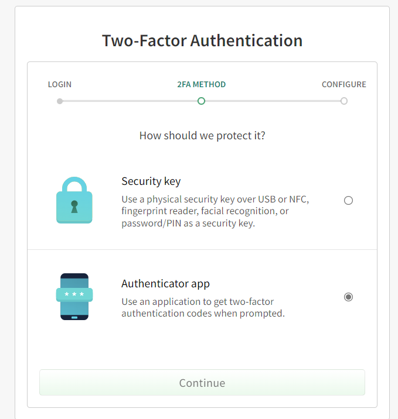

然后打开下载的 app 扫描二维码就能添加好了。

### 上传图片

在需要上传的文件夹中打开终端或者 git bash，输入以下指令切换回原生源

```bash
npm config set registry https://registry.npmjs.org
```

添加本地 npm 用户设置

```bash
# 仅第一次使用需要添加用户，之后会提示你输入你的npm账号密码以及注册邮箱
npm adduser
# 非第一次使用直接登录即可，之后会提示你输入你的npm账号密码以及注册邮箱
npm login
```

运行 npm 初始化指令，把整个图床仓库打包，按照指示进行配置，注意需要事先确认你的包名没有和别人已发布的包重复，可以在 npm 官网搜索相应包名，搜不到就说明还没被占用。

```bash
npm init
```

接下来要填写一些信息

```bash
#npm包名称，建议用id+仓库名，可以避免重名
package name:xiansakana-assets
#版本号
version:1.0.0
#描述，可以不写
description:
#入口点，默认即可
entry point:
#测试命令，默认即可
test command:
#关联的github仓库，也可以不写
git repository:
#关键词，也可以不写
keywords:
#作者名
author:xiansakana
#许可证，默认即可
license:
```

然后输入发布指令，我们就可以把包发布到 npm 上了

```bash
npm publish
```

> npm 每次 publish 更新前都需要在 `package.json` 修改 `version` 版本号，所以可以用更新 package.json 里的版本号的指令，效果是末尾版本号+1，例如`0.0.1=>0.0.2`、`1.1.3=>1.1.4`，免去了打开`package.json`再修改版本号的麻烦。（大版本更新还是需要手动改的）

```bash
// patch：补丁号，修复bug，小变动，如 v1.0.0->v1.0.1
npm version patch

// minor：次版本号，增加新功能，如 v1.0.0->v1.1.0
npm version minor

// major：主版本号，不兼容的修改，如 v1.0.0->v2.0.0
npm version major

```

我个人的做法是用bat批处理，新建一个`npm publish.bat`文件

```bash
start cmd /c "d: && cd data/npm/xiansakana-blog-img && npm version patch && npm publish"

```

当然除此之外也还可以添加github action自动发布npm包

首先进入github仓库的action，然后choose a workflw，选择simple workflow，修改该yml

```yml
name: Node.js Package

on:
  push:
    branches:
      - main

jobs:
  publish-npm:
    runs-on: ubuntu-latest
    steps:
      - uses: actions/checkout@v2
      - uses: actions/setup-node@v1
        with:
          node-version: "12.x"
          registry-url: https://registry.npmjs.org/ 
      - run: npm publish
        env:
          NODE_AUTH_TOKEN: ${{secrets.npm_token}}
```

然后去npmjs创建npm token，选择automation

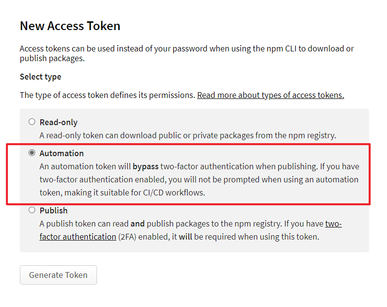

在github仓库的secrets中创建new repository secret

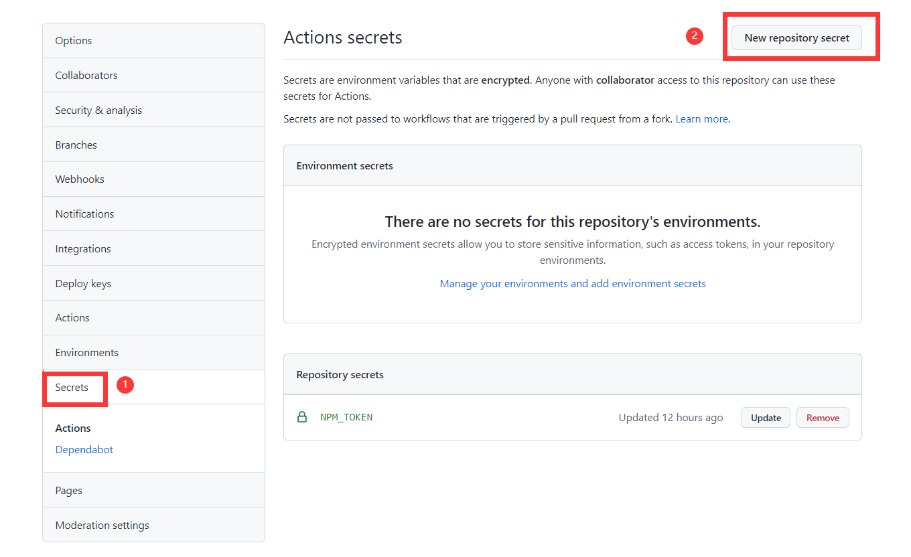

在本地的仓库文件夹下打开终端，运行以下指令，上传新增内容至github，即可触发部署。

```bash
# 将更改提交  
git add .  
git commit -m "npm publish"  
# 更新package版本号  
npm version patch  
# 推送至github触发action  
git push
```

### 引用图片

npm 的很大优点是，节点有很多，可以任意挑一个使用。目前节点有：

jsDelivr+npm
https://cdn.jsdelivr.net/npm/package@version/file

百度节点
https://code.bdstatic.com/npm/package@version/file

饿了么节点，回源是Unpkg
https://npm.elemecdn.com/package@version/file

饿了么节点，回源是JSdelivr
https://shadow.elemecdn.com/npm/package@version/file

unpkg 自建(UNPKG是一个内容源自npm的全球快速CDN。它部署在cloudflare上，在大陆地区访问到的是香港节点。所以速度也不错。)
https://cdn.cbd.int/package@version/file
https://unpkg.com/package@version/file

另外，如果是直接通过包名和文件的方式不添加版本号访问，默认是最新版本的 package，比如
https://cdn.jsdelivr.net/npm/[NpmPackageName]/[file]

> 关于图片缓存服务：
>
> 可以将有防盗链的图片引用到网页，并成功显示。
> 可以将 http 图片引用到 https 页面而不出现证书问题。
> 可以将 xxx 的图片，成功加载。
> 可以将比较慢的图片资源，加快显示。

> 国内网宿节点，只能加载特定图床图片如imgur
> https://search.pstatic.net/common/?src=
> Akamai节点，没有使用限制
> https://imageproxy.pimg.tw/resize?url=
> CloudFlare节点
> https://images.weserv.nl/?url=
> CloudFlare节点
> https://pic1.xuehuaimg.com/proxy/

## Backblaze + Cloudflare + PicGo

这个方案有以下优势：

- 每月前 10G 流量免费
- Cloudflare 做 CDN 加速
- 可自定义域名

开始前，你需要有以下条件：

- 域名
- Backblaze 账户
- Cloudflare 账户: 按照网站提示接入域名即可

### Backblaze

**[Backblaze](https://www.backblaze.com)** 是一个云存储解决方案，为什么选用他呢，是因为其前 10G 存储是完全免费的，这用于做图床是非常够用的。

先注册一个账号（输入邮箱就行），然后点击`Create a Bucket`，创建一个存储桶，填写名称，记得选择`Public`权限，注意存储桶名称在 Backblaze 中必须是*全局唯一的*，

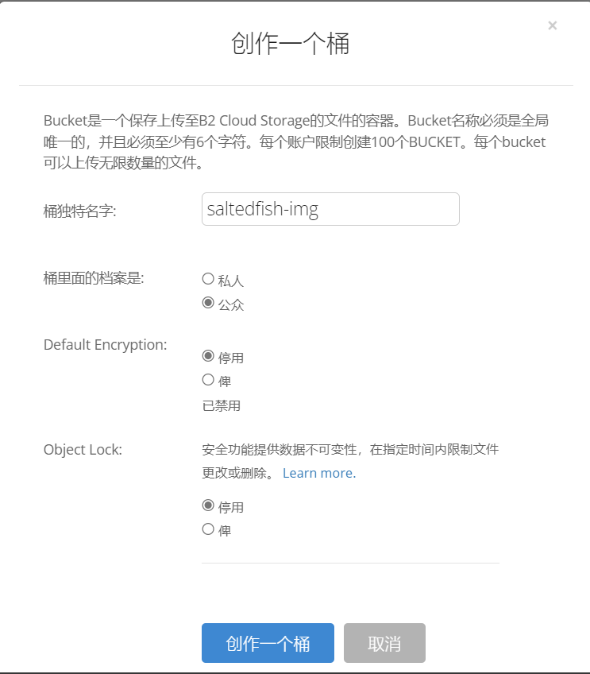

之后点击生命周期的设置，将其设置为`Keep only the last version of the file`，只保留 bucket 内最新版本的文件。

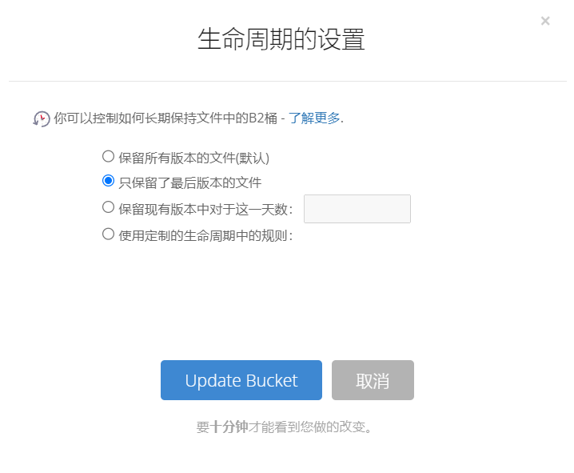

为了获取桶域名，点击`Browse Files`直接上传一张图片，上传成功后直接点击图片，会看到如下信息：

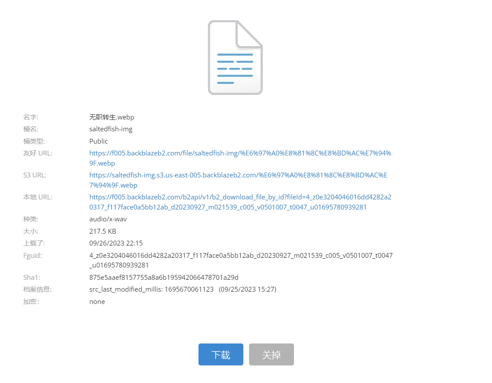​

### Cloudflare

打开[Cloudflare 官网](https://www.cloudflare.com/zh-cn/)并进行注册

根据提示前往域名注册商修改 DNS 解析服务器到 Cloudflare 提供给你的服务器地址，不同用户地址不同，个人使用选择免费计划即可。

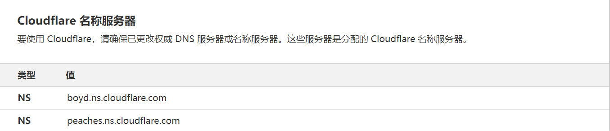

提取之前在 Backblaze 中`Friendly URL`显示的域名信息，比如我这里是：`https://f005.backblazeb2.com/`，然后在 `Cloudflare` 添加新的 CNAME 记录，二级域名可以根据喜好选择

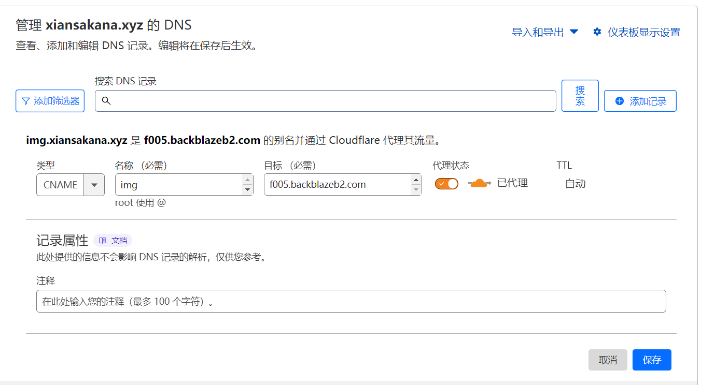

接下来点击左侧的`SSL/TLS`，设置**完全(严格)** 模式：

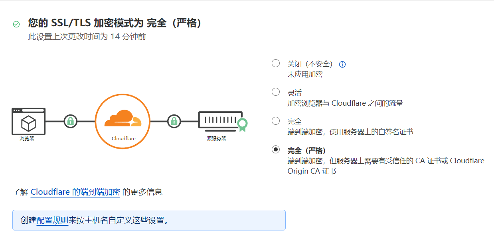

为了避免无法命中缓存或回源次数过多导致加载速度低下，我们需要回到 Backblaze 进行桶信息设置，添加`{"cache-control":"max-age=86400"}`，意味 86400 秒内 Cloudflare 不再返回源站重新获取信息。

> 注意，回源时为 CDN 节点回源站重新拉去数据，然后再传递给用户，并不是将源站地址直接转给用户，所以无需担心回源过多导致的免费流量配额消耗完毕。max-age 可以不用太长，太长的话若源文件发生更改，且站点没有主动推送到 CDN 节点时会导致用户不能及时得到最新版本。（`BackBlaze`也存在免费请求次数显示，B 类 C 类请求每天各 2500 次，暂时未确定 Cloudflare 访问是否计算请求次数，故也不建议太短）

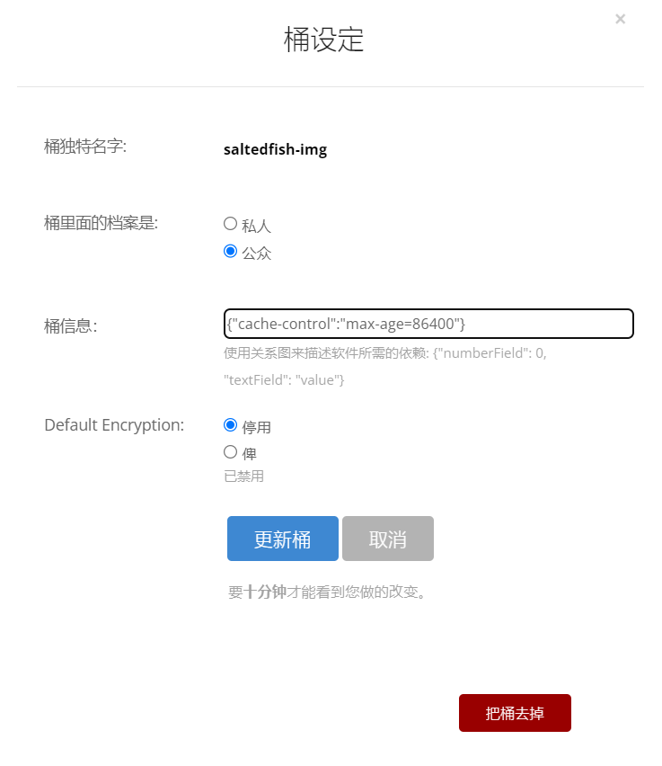

接下来使用 Cloudflare 的转换规则隐藏 bucket 名称，选择左侧规则中的转换规则，然后创建一个新的转换规则

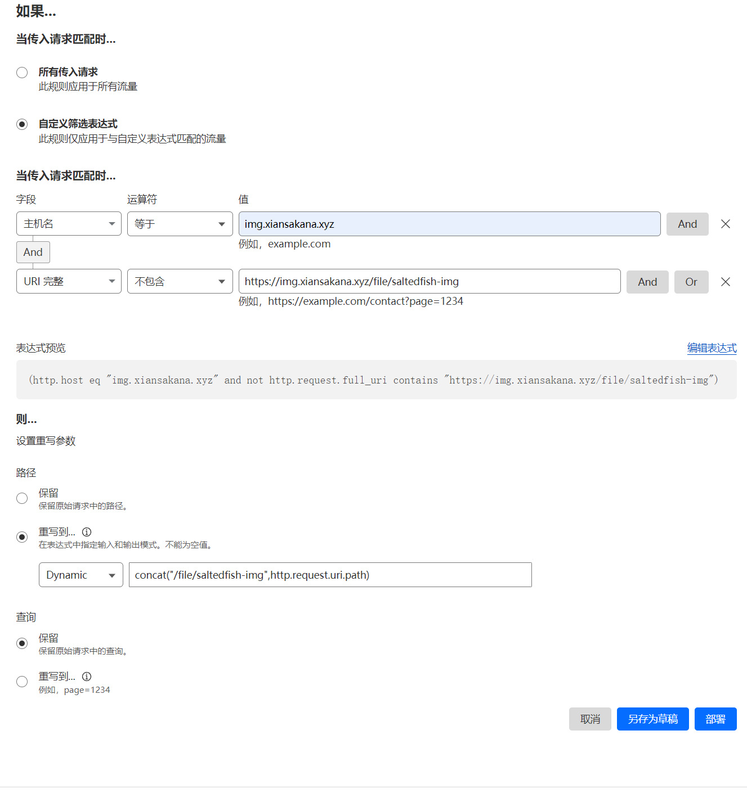

之后将`Friendly URL`中的`f005.backblazeb2.com/file/saltedfish-img/`替换为刚刚自定义的域名后，就能正常打开图片了。

在浏览器中打开开发人员工具（默认快捷键是F12），可以看到在请求链接时，响应头有一些X-Bz开头的字段，这些都是和Backblaze云存储相关的，要把它们都隐藏掉。

在Cloudflare打开Rules>Transform Rules，选择Modify Response Header，点击Create rule创建响应头修改规则。选择All incoming requests，通过点击Set new header来添加一行Header配置，将类型设置为Remove，将所有X-Bz开头的字段添加进去，然后点击Deploy部署规则即可

```text
X-Bz-Content-Sha1
X-Bz-File-Id
X-Bz-File-Name
X-Bz-Info-Src_last_modified_millis
X-Bz-Upload-Timestamp
```

最后再次测试、查看响应头信息中，规则配置好的字段是否都已移除。

### PicGo

图床搭建完毕后，若不进行其他操作，每次上传图片都需要打开 Backblaze 的网站并在完成身份验证后进入桶设置页面进行上传，即不便捷也不友好。因此介绍一款跨平台且同时支持命令行与可视化界面的图片上传工具——PicGo。主要功能即为上传图片到你指定的位置，并获取图片链接，搭配 typora 编辑器可以直接在粘贴图片时就自动上传并将链接写入 Markdown 文档，避免图片在其它网站或放在本地后移动文档导致的图片丢失。

进入[项目主页](https://github.com/Molunerfinn/PicGo)，下载并安装 PicGo。

选择插件设置，搜索`s3`或进入[插件项目主页](https://github.com/wayjam/picgo-plugin-s3)下载并安装该插件。

为了让第三方软件可以使用`Backblaze`，接下来需要获取`Application Keys`，打开的[Backblaze 官网的 AppKeys 设置页面](https://secure.backblaze.com/app_keys.htm)，添加一个新的 Key 建议不要使用建议不要使用`Master Application Key`。

> **注意：Key 的最长有效时间为 1000 天，即 86400000 秒，过期后请重新申请**

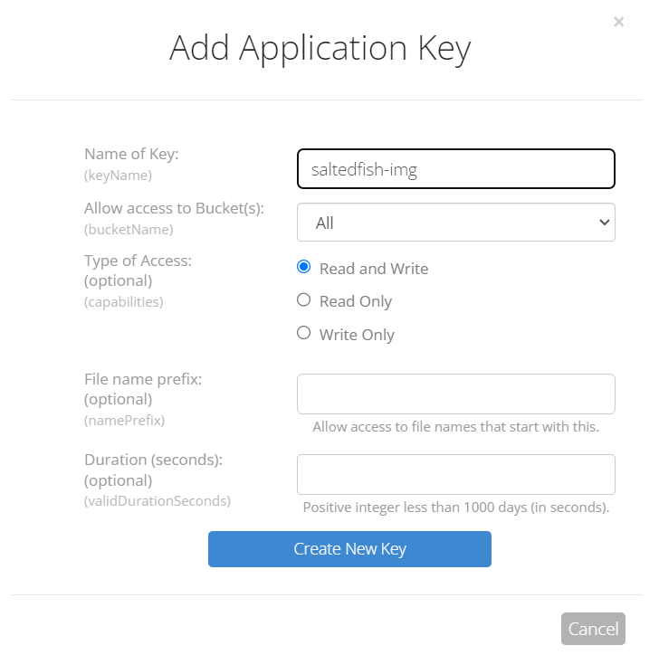

当密钥创建成功，记录得到的`Key ID、applicationKey、桶名称、桶的Endpoint地址`，因为页面关闭后就自动不再展示。分别填写到对应位置。

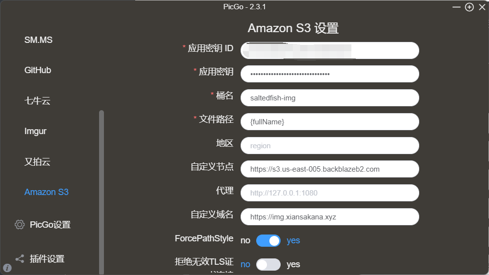

之后就是一边写博客，一边把图片往支持额外命令行的编辑器（比如[typora](https://typora.io/)）里拖放或者黏贴就行了。

## 阿里云 oss

首先放上官网：[https://oss.console.aliyun.com](https://oss.console.aliyun.com)

### 创建一个 Bucket

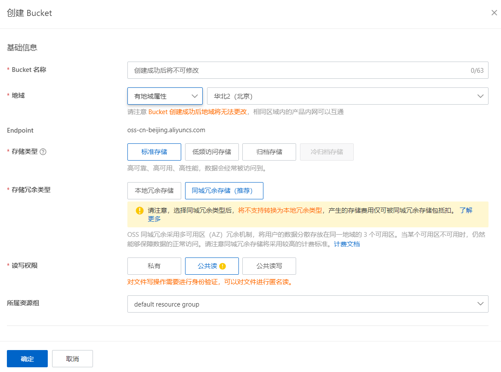

### 绑定域名（若无则跳过）

试了下结果要备案，毕竟我是托管在 github 上面的就没必要备案，而且备案听说很麻烦，所以...嗯。咕咕咕

### 上传文件

然后就可以在文件列表中上传文件了，但是这样管理起来会不太方便，所以可以考虑下载客户端：[安装并登录 ossbrowser](https://help.aliyun.com/zh/oss/developer-reference/install-and-log-on-to-ossbrowser#p-r5p-536-llr)

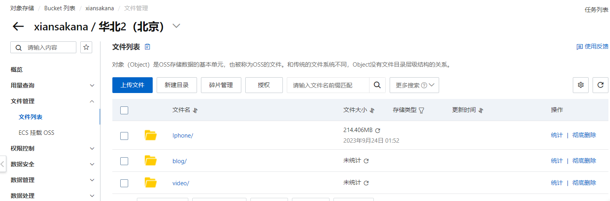

同时，阿里云 oss 也可以通过 PicGo 来上传，但是需要添加 key。首先选择右上角的 AccessKey 管理然后创建 AccessKey 就行了。

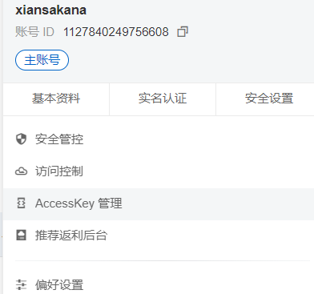

同样，记下生成的`AccessKey ID`和`AccessKey Secret`，然后添加到 PicGo 中就可以使用啦。


