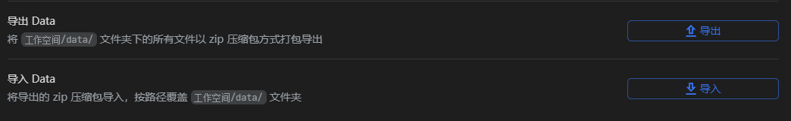

# Obsidian

obsidian是基于本地储存的markdown类型的笔记软件。

之前用Obsidian的时候，我就发现有这么几个问题

1. 同步困难
2. 不支持块结构
3. 图片大小无法编辑
4. 有时外链图片加载失败
5. 无TOC

不过好处在于Obsidian的插件众多，到是可以通过第三方插件`Obsidian Git`​扩展功能自动定时推送到github起到自动备份的作用，而且也有`Floating TOC`​可以用来展示TOC文章目录。下面是我常用的几个第三方插件

1. Emoji Shortcodes
2. Floating TOC
3. Markdown Prettifier
4. Media Extended
5. Mousewheel Image Zoom
6. Obsidian Git
7. Remember Cursor Position

后来我又解锁了新的用法，将Gitbook同步Obsidian的自动git备份库，就可以起到笔记web浏览的作用了，解决了本地笔记的痛点之一。

‍

# 思源笔记

我一直以为它是那种普通的富文本形式，结果试了才发现竟然也是基于块编辑器和markdown编辑器于一体的那种，再加上本地储存，数据安全和隐私有保障，算是完全撞上我的xp了。

各种功能基本上齐全，而且本地储存和服务端储存相比最大的优势就是流畅不卡，不管你的文件有多大，基本上不会很卡，而之前体验过的notion和类notion的产品比如wolai、FlowUS等等文件一大都有卡顿的诟病，而且容量以及上传的图片大小都会有限制，最重要的是笔记的迁移问题，这些本地都不是问题。

但是，本地笔记最大的问题就是同步，尽管说思源笔记官方给了付费版的同步方案，但是对于白嫖党这显然当然不能接受，好在办法总比困难多，很快我就找到了一个替代方案。

<u>[思源笔记第三方网盘自动备份，单向同步内容到安卓手机的解决办法](https://zhuanlan.zhihu.com/p/536971847)</u>

简单来说，就是通过SiYuan的导入导出功能来备份Data

​​

因为这个导出Data的功能相当于是给data文件夹打了个压缩包，于是我们可以直接用命令行自动定时打包，然后将压缩包放到网盘同步文件夹，比如OneDrive或者GoogleDrive等。思源笔记的文件夹是不支持直接放到网盘同步盘目录中的，如果直接同步会崩溃，所以不得不另辟蹊径。

具体的bat代码如下，目录可自行修改，如果不想加上时间戳可删除相应部分。

```bat
@ECHO OFF
SETLOCAL

REM 获取系统时间，并处理小时数可能的空格问题
SET "h=%time:~0,2%"
SET "N=%h: =0%"

REM 构造年月日和时分秒的字符串
SET "ymd=%date:~0,4%%date:~5,2%%date:~8,2%"
SET "hms=%N%%time:~3,2%%time:~6,2%"

REM 组合日期和时间以创建时间戳
SET "dt=%ymd%%hms%"

REM 使用 Bandizip 压缩文件，并将时间戳添加到文件名中
bz c "D:\data\OneDrive - nyu.edu\backup\SiYuan\SiYuanBackup-%dt%.zip" "D:\data\SiYuan\data\"

ECHO Backup completed successfully.
```

然后通过windows的任务计划程序给这个bat文件添加一个定时任务，定期自动备份就可以了。

‍

# Notion

notion尽管可以说是业界标杆了，优点就不提了，因为实在是太多了，包括功能齐全、流畅度以及页面观感但对于我来说还是有很多可以改进的地方

1. 缺少TOC
2. 导入md文件后，代码块不会换行和格式化
3. 页面的样式设定无法保存应用到全部页面，以至于每个不同的页面都需要重新设定
4. 虽然说可以嵌入云盘中的媒体，但对于音频和视频进度条无法拖动
5. ‍

‍

‍

# 钉钉个人版

可以嵌入阿里云盘

‍
